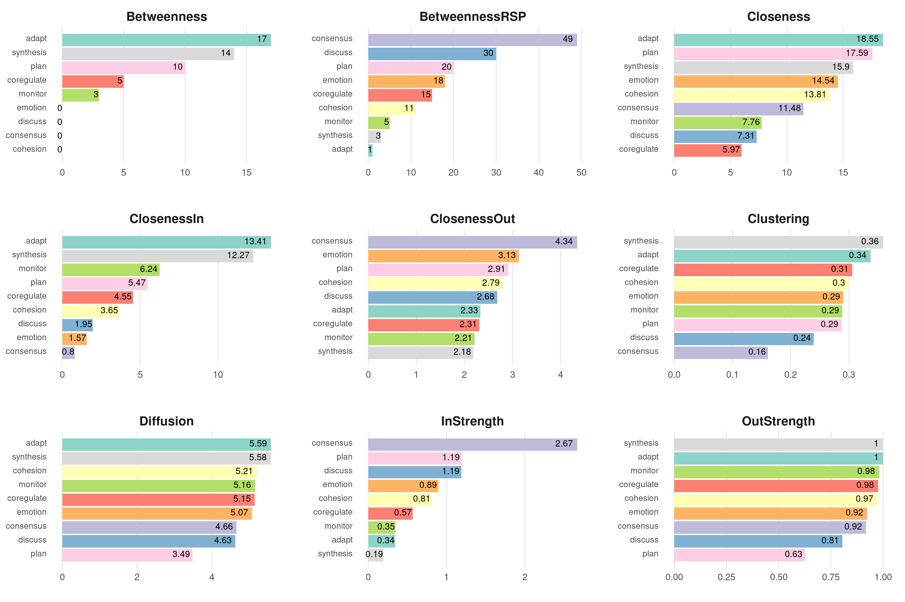
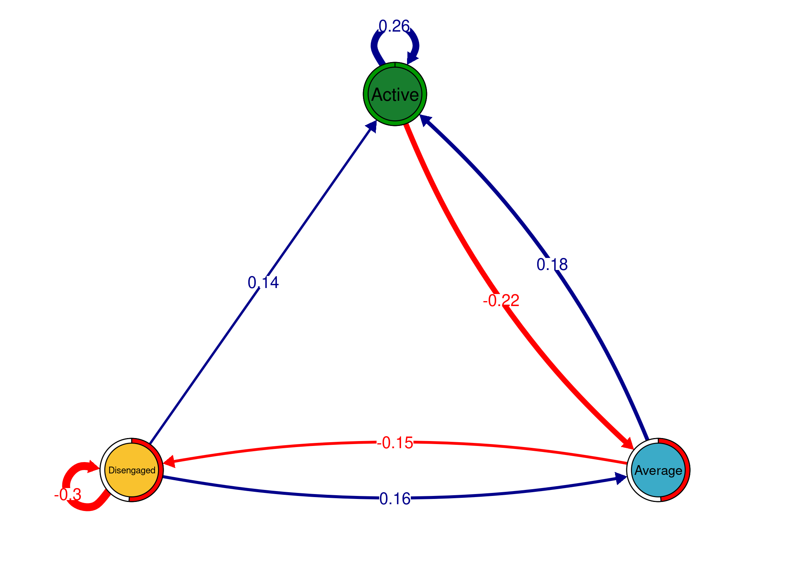

<!-- README.md is generated from README.Rmd. Please edit that file -->

# `tna`: An R package for Transition Network Analysis

<!-- badges: start -->
<!-- badges: end -->

## Installation

You can install the development version of `tna` from
[GitHub](https://github.com/) with:

``` r
# install.packages("devtools")
devtools::install_github("sonsoleslp/tna")
```

## Example

Load the library

``` r
library("tna")
```

Example data

``` r
data("engagement", package = "tna")
```

Build a Markov model

``` r
tna_model <- build_tna(engagement)
```

Plot the transition network

``` r
plot(tna_model)
```


Calculate the centrality measures

``` r
cm <- centralities(tna_model, normalize = T)
cm
#> # A tibble: 3 × 9
#>   State    OutStrength InStrength ClosenessIn ClosenessOut Closeness Betweenness
#> * <chr>          <dbl>      <dbl>       <dbl>        <dbl>     <dbl>       <dbl>
#> 1 Active         0.823      0.381       0.686        0.920     0.835       0.333
#> 2 Average        0.757      1           0.261        1         0.555       1    
#> 3 Disenga…       1          0.261       1            0.757     1           0.333
#> # ℹ 2 more variables: Diffusion <dbl>, Clustering <dbl>
```

Plot the centrality measures

``` r
plot(cm, ncol =  4, scales = "fixed",
     line_color = tna_model$colors, point_color = tna_model$colors) 
```


Compare those who started as active with the rest

``` r
tna_model_start_active <- build_tna(engagement[engagement[,1]=="Active",])
tna_model_start_other <- build_tna(engagement[engagement[,1]!="Active",])
plot_compare(tna_model_start_active, tna_model_start_other)
```


