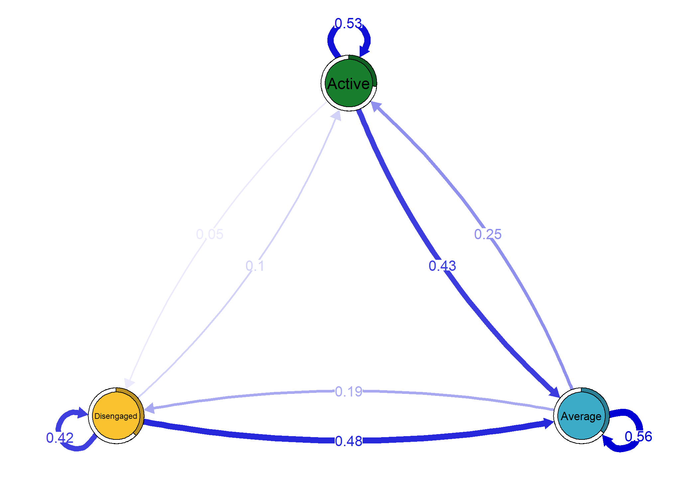

<!-- README.md is generated from README.Rmd. Please edit that file -->

# `tna`: An R package for Transition Network Analysis

<!-- badges: start -->
<!-- badges: end -->

## Installation

You can install the development version of `tna` from
[GitHub](https://github.com/) with:

``` r
# install.packages("devtools")
devtools::install_github("sonsoleslp/tna")
```

## Example

Load the library

``` r
library("tna")
```

Example data

``` r
data("engagement", package = "tna")
```

Build a Markov model

``` r
tna_model <- build_tna(engagement)
```

Plot the transition network

``` r
plot(tna_model)
```



Calculate the centrality measures

``` r
cm <- centralities(tna_model)
```

<div id="jwpnhpihxf" style="padding-left:0px;padding-right:0px;padding-top:10px;padding-bottom:10px;overflow-x:auto;overflow-y:auto;width:auto;height:auto;">
<style>#jwpnhpihxf table {
  font-family: system-ui, 'Segoe UI', Roboto, Helvetica, Arial, sans-serif, 'Apple Color Emoji', 'Segoe UI Emoji', 'Segoe UI Symbol', 'Noto Color Emoji';
  -webkit-font-smoothing: antialiased;
  -moz-osx-font-smoothing: grayscale;
}

#jwpnhpihxf thead, #jwpnhpihxf tbody, #jwpnhpihxf tfoot, #jwpnhpihxf tr, #jwpnhpihxf td, #jwpnhpihxf th {
  border-style: none;
}

#jwpnhpihxf p {
  margin: 0;
  padding: 0;
}

#jwpnhpihxf .gt_table {
  display: table;
  border-collapse: collapse;
  line-height: normal;
  margin-left: auto;
  margin-right: auto;
  color: #333333;
  font-size: 8px;
  font-weight: normal;
  font-style: normal;
  background-color: #FFFFFF;
  width: auto;
  border-top-style: solid;
  border-top-width: 2px;
  border-top-color: #A8A8A8;
  border-right-style: none;
  border-right-width: 2px;
  border-right-color: #D3D3D3;
  border-bottom-style: solid;
  border-bottom-width: 2px;
  border-bottom-color: #A8A8A8;
  border-left-style: none;
  border-left-width: 2px;
  border-left-color: #D3D3D3;
}

#jwpnhpihxf .gt_caption {
  padding-top: 4px;
  padding-bottom: 4px;
}

#jwpnhpihxf .gt_title {
  color: #333333;
  font-size: 125%;
  font-weight: initial;
  padding-top: 4px;
  padding-bottom: 4px;
  padding-left: 5px;
  padding-right: 5px;
  border-bottom-color: #FFFFFF;
  border-bottom-width: 0;
}

#jwpnhpihxf .gt_subtitle {
  color: #333333;
  font-size: 85%;
  font-weight: initial;
  padding-top: 3px;
  padding-bottom: 5px;
  padding-left: 5px;
  padding-right: 5px;
  border-top-color: #FFFFFF;
  border-top-width: 0;
}

#jwpnhpihxf .gt_heading {
  background-color: #FFFFFF;
  text-align: center;
  border-bottom-color: #FFFFFF;
  border-left-style: none;
  border-left-width: 1px;
  border-left-color: #D3D3D3;
  border-right-style: none;
  border-right-width: 1px;
  border-right-color: #D3D3D3;
}

#jwpnhpihxf .gt_bottom_border {
  border-bottom-style: solid;
  border-bottom-width: 2px;
  border-bottom-color: #D3D3D3;
}

#jwpnhpihxf .gt_col_headings {
  border-top-style: solid;
  border-top-width: 2px;
  border-top-color: #D3D3D3;
  border-bottom-style: solid;
  border-bottom-width: 2px;
  border-bottom-color: #D3D3D3;
  border-left-style: none;
  border-left-width: 1px;
  border-left-color: #D3D3D3;
  border-right-style: none;
  border-right-width: 1px;
  border-right-color: #D3D3D3;
}

#jwpnhpihxf .gt_col_heading {
  color: #333333;
  background-color: #FFFFFF;
  font-size: 100%;
  font-weight: normal;
  text-transform: inherit;
  border-left-style: none;
  border-left-width: 1px;
  border-left-color: #D3D3D3;
  border-right-style: none;
  border-right-width: 1px;
  border-right-color: #D3D3D3;
  vertical-align: bottom;
  padding-top: 5px;
  padding-bottom: 6px;
  padding-left: 5px;
  padding-right: 5px;
  overflow-x: hidden;
}

#jwpnhpihxf .gt_column_spanner_outer {
  color: #333333;
  background-color: #FFFFFF;
  font-size: 100%;
  font-weight: normal;
  text-transform: inherit;
  padding-top: 0;
  padding-bottom: 0;
  padding-left: 4px;
  padding-right: 4px;
}

#jwpnhpihxf .gt_column_spanner_outer:first-child {
  padding-left: 0;
}

#jwpnhpihxf .gt_column_spanner_outer:last-child {
  padding-right: 0;
}

#jwpnhpihxf .gt_column_spanner {
  border-bottom-style: solid;
  border-bottom-width: 2px;
  border-bottom-color: #D3D3D3;
  vertical-align: bottom;
  padding-top: 5px;
  padding-bottom: 5px;
  overflow-x: hidden;
  display: inline-block;
  width: 100%;
}

#jwpnhpihxf .gt_spanner_row {
  border-bottom-style: hidden;
}

#jwpnhpihxf .gt_group_heading {
  padding-top: 8px;
  padding-bottom: 8px;
  padding-left: 5px;
  padding-right: 5px;
  color: #333333;
  background-color: #FFFFFF;
  font-size: 100%;
  font-weight: initial;
  text-transform: inherit;
  border-top-style: solid;
  border-top-width: 2px;
  border-top-color: #D3D3D3;
  border-bottom-style: solid;
  border-bottom-width: 2px;
  border-bottom-color: #D3D3D3;
  border-left-style: none;
  border-left-width: 1px;
  border-left-color: #D3D3D3;
  border-right-style: none;
  border-right-width: 1px;
  border-right-color: #D3D3D3;
  vertical-align: middle;
  text-align: left;
}

#jwpnhpihxf .gt_empty_group_heading {
  padding: 0.5px;
  color: #333333;
  background-color: #FFFFFF;
  font-size: 100%;
  font-weight: initial;
  border-top-style: solid;
  border-top-width: 2px;
  border-top-color: #D3D3D3;
  border-bottom-style: solid;
  border-bottom-width: 2px;
  border-bottom-color: #D3D3D3;
  vertical-align: middle;
}

#jwpnhpihxf .gt_from_md > :first-child {
  margin-top: 0;
}

#jwpnhpihxf .gt_from_md > :last-child {
  margin-bottom: 0;
}

#jwpnhpihxf .gt_row {
  padding-top: 8px;
  padding-bottom: 8px;
  padding-left: 5px;
  padding-right: 5px;
  margin: 10px;
  border-top-style: solid;
  border-top-width: 1px;
  border-top-color: #D3D3D3;
  border-left-style: none;
  border-left-width: 1px;
  border-left-color: #D3D3D3;
  border-right-style: none;
  border-right-width: 1px;
  border-right-color: #D3D3D3;
  vertical-align: middle;
  overflow-x: hidden;
}

#jwpnhpihxf .gt_stub {
  color: #333333;
  background-color: #FFFFFF;
  font-size: 100%;
  font-weight: initial;
  text-transform: inherit;
  border-right-style: solid;
  border-right-width: 2px;
  border-right-color: #D3D3D3;
  padding-left: 5px;
  padding-right: 5px;
}

#jwpnhpihxf .gt_stub_row_group {
  color: #333333;
  background-color: #FFFFFF;
  font-size: 100%;
  font-weight: initial;
  text-transform: inherit;
  border-right-style: solid;
  border-right-width: 2px;
  border-right-color: #D3D3D3;
  padding-left: 5px;
  padding-right: 5px;
  vertical-align: top;
}

#jwpnhpihxf .gt_row_group_first td {
  border-top-width: 2px;
}

#jwpnhpihxf .gt_row_group_first th {
  border-top-width: 2px;
}

#jwpnhpihxf .gt_summary_row {
  color: #333333;
  background-color: #FFFFFF;
  text-transform: inherit;
  padding-top: 8px;
  padding-bottom: 8px;
  padding-left: 5px;
  padding-right: 5px;
}

#jwpnhpihxf .gt_first_summary_row {
  border-top-style: solid;
  border-top-color: #D3D3D3;
}

#jwpnhpihxf .gt_first_summary_row.thick {
  border-top-width: 2px;
}

#jwpnhpihxf .gt_last_summary_row {
  padding-top: 8px;
  padding-bottom: 8px;
  padding-left: 5px;
  padding-right: 5px;
  border-bottom-style: solid;
  border-bottom-width: 2px;
  border-bottom-color: #D3D3D3;
}

#jwpnhpihxf .gt_grand_summary_row {
  color: #333333;
  background-color: #FFFFFF;
  text-transform: inherit;
  padding-top: 8px;
  padding-bottom: 8px;
  padding-left: 5px;
  padding-right: 5px;
}

#jwpnhpihxf .gt_first_grand_summary_row {
  padding-top: 8px;
  padding-bottom: 8px;
  padding-left: 5px;
  padding-right: 5px;
  border-top-style: double;
  border-top-width: 6px;
  border-top-color: #D3D3D3;
}

#jwpnhpihxf .gt_last_grand_summary_row_top {
  padding-top: 8px;
  padding-bottom: 8px;
  padding-left: 5px;
  padding-right: 5px;
  border-bottom-style: double;
  border-bottom-width: 6px;
  border-bottom-color: #D3D3D3;
}

#jwpnhpihxf .gt_striped {
  background-color: rgba(128, 128, 128, 0.05);
}

#jwpnhpihxf .gt_table_body {
  border-top-style: solid;
  border-top-width: 2px;
  border-top-color: #D3D3D3;
  border-bottom-style: solid;
  border-bottom-width: 2px;
  border-bottom-color: #D3D3D3;
}

#jwpnhpihxf .gt_footnotes {
  color: #333333;
  background-color: #FFFFFF;
  border-bottom-style: none;
  border-bottom-width: 2px;
  border-bottom-color: #D3D3D3;
  border-left-style: none;
  border-left-width: 2px;
  border-left-color: #D3D3D3;
  border-right-style: none;
  border-right-width: 2px;
  border-right-color: #D3D3D3;
}

#jwpnhpihxf .gt_footnote {
  margin: 0px;
  font-size: 90%;
  padding-top: 4px;
  padding-bottom: 4px;
  padding-left: 5px;
  padding-right: 5px;
}

#jwpnhpihxf .gt_sourcenotes {
  color: #333333;
  background-color: #FFFFFF;
  border-bottom-style: none;
  border-bottom-width: 2px;
  border-bottom-color: #D3D3D3;
  border-left-style: none;
  border-left-width: 2px;
  border-left-color: #D3D3D3;
  border-right-style: none;
  border-right-width: 2px;
  border-right-color: #D3D3D3;
}

#jwpnhpihxf .gt_sourcenote {
  font-size: 90%;
  padding-top: 4px;
  padding-bottom: 4px;
  padding-left: 5px;
  padding-right: 5px;
}

#jwpnhpihxf .gt_left {
  text-align: left;
}

#jwpnhpihxf .gt_center {
  text-align: center;
}

#jwpnhpihxf .gt_right {
  text-align: right;
  font-variant-numeric: tabular-nums;
}

#jwpnhpihxf .gt_font_normal {
  font-weight: normal;
}

#jwpnhpihxf .gt_font_bold {
  font-weight: bold;
}

#jwpnhpihxf .gt_font_italic {
  font-style: italic;
}

#jwpnhpihxf .gt_super {
  font-size: 65%;
}

#jwpnhpihxf .gt_footnote_marks {
  font-size: 75%;
  vertical-align: 0.4em;
  position: initial;
}

#jwpnhpihxf .gt_asterisk {
  font-size: 100%;
  vertical-align: 0;
}

#jwpnhpihxf .gt_indent_1 {
  text-indent: 5px;
}

#jwpnhpihxf .gt_indent_2 {
  text-indent: 10px;
}

#jwpnhpihxf .gt_indent_3 {
  text-indent: 15px;
}

#jwpnhpihxf .gt_indent_4 {
  text-indent: 20px;
}

#jwpnhpihxf .gt_indent_5 {
  text-indent: 25px;
}
</style>
<table class="gt_table" data-quarto-disable-processing="false" data-quarto-bootstrap="false">
  <thead>
    <tr class="gt_col_headings">
      <th class="gt_col_heading gt_columns_bottom_border gt_center" rowspan="1" colspan="1" scope="col" id="State">State</th>
      <th class="gt_col_heading gt_columns_bottom_border gt_right" rowspan="1" colspan="1" scope="col" id="OutStrength">OutStrength</th>
      <th class="gt_col_heading gt_columns_bottom_border gt_right" rowspan="1" colspan="1" scope="col" id="InStrength">InStrength</th>
      <th class="gt_col_heading gt_columns_bottom_border gt_right" rowspan="1" colspan="1" scope="col" id="ClosenessIn">ClosenessIn</th>
      <th class="gt_col_heading gt_columns_bottom_border gt_right" rowspan="1" colspan="1" scope="col" id="ClosenessOut">ClosenessOut</th>
      <th class="gt_col_heading gt_columns_bottom_border gt_right" rowspan="1" colspan="1" scope="col" id="Closeness">Closeness</th>
      <th class="gt_col_heading gt_columns_bottom_border gt_right" rowspan="1" colspan="1" scope="col" id="Betweenness">Betweenness</th>
      <th class="gt_col_heading gt_columns_bottom_border gt_right" rowspan="1" colspan="1" scope="col" id="Diffusion">Diffusion</th>
      <th class="gt_col_heading gt_columns_bottom_border gt_right" rowspan="1" colspan="1" scope="col" id="Clustering">Clustering</th>
    </tr>
  </thead>
  <tbody class="gt_table_body">
    <tr><td headers="State" class="gt_row gt_center">Active</td>
<td headers="OutStrength" class="gt_row gt_right">0.4748011</td>
<td headers="InStrength" class="gt_row gt_right">0.3454093</td>
<td headers="ClosenessIn" class="gt_row gt_right">2.895116</td>
<td headers="ClosenessOut" class="gt_row gt_right">2.106145</td>
<td headers="Closeness" class="gt_row gt_right">3.523981</td>
<td headers="Betweenness" class="gt_row gt_right">1</td>
<td headers="Diffusion" class="gt_row gt_right">0.7977627</td>
<td headers="Clustering" class="gt_row gt_right">0.6682528</td></tr>
    <tr><td headers="State" class="gt_row gt_center">Average</td>
<td headers="OutStrength" class="gt_row gt_right">0.4367390</td>
<td headers="InStrength" class="gt_row gt_right">0.9061450</td>
<td headers="ClosenessIn" class="gt_row gt_right">1.103576</td>
<td headers="ClosenessOut" class="gt_row gt_right">2.289697</td>
<td headers="Closeness" class="gt_row gt_right">2.342159</td>
<td headers="Betweenness" class="gt_row gt_right">3</td>
<td headers="Diffusion" class="gt_row gt_right">0.7648861</td>
<td headers="Clustering" class="gt_row gt_right">0.1455791</td></tr>
    <tr><td headers="State" class="gt_row gt_center">Disengaged</td>
<td headers="OutStrength" class="gt_row gt_right">0.5769231</td>
<td headers="InStrength" class="gt_row gt_right">0.2369088</td>
<td headers="ClosenessIn" class="gt_row gt_right">4.221033</td>
<td headers="ClosenessOut" class="gt_row gt_right">1.733333</td>
<td headers="Closeness" class="gt_row gt_right">4.221033</td>
<td headers="Betweenness" class="gt_row gt_right">1</td>
<td headers="Diffusion" class="gt_row gt_right">0.9622080</td>
<td headers="Clustering" class="gt_row gt_right">0.6746312</td></tr>
  </tbody>
  
  
</table>
</div>

Plot the centrality measures

``` r
plot(cm, ncol =  4, reorder = T, line_color = tna_model$colors, point_color = tna_model$colors) 
```


Compare those who started as active with the rest

``` r
tna_model_start_active <- build_tna(engagement[engagement[,1]=="Active",])
tna_model_start_other <- build_tna(engagement[engagement[,1]!="Active",])
plot_compare(tna_model_start_active, tna_model_start_other)
```


