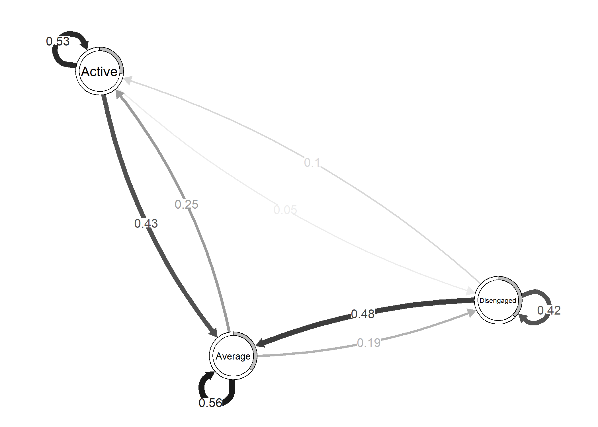
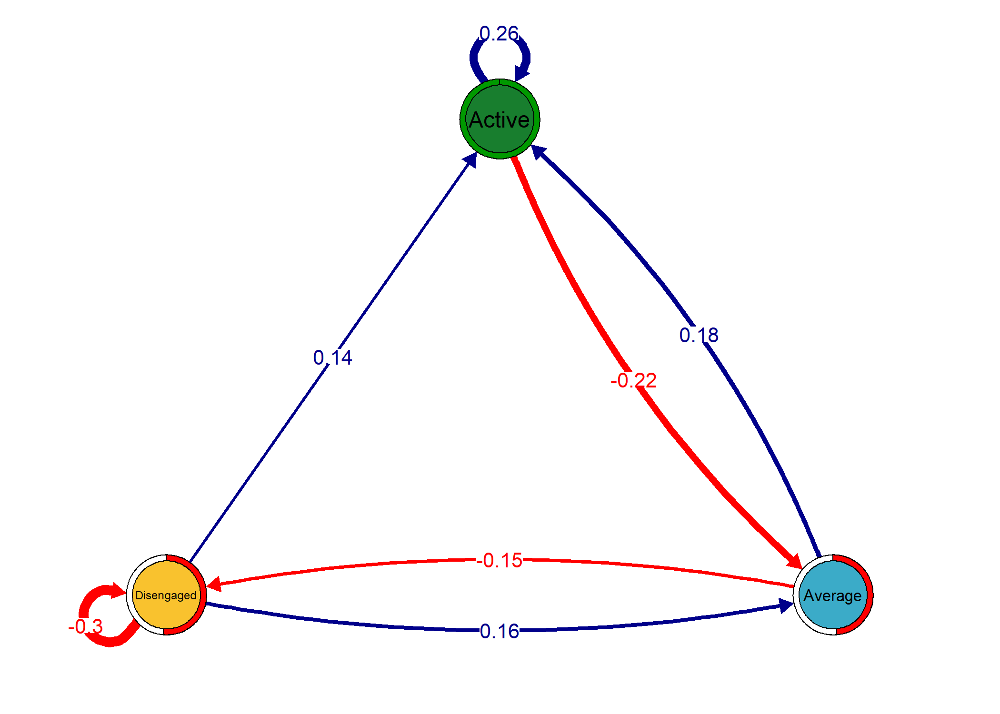

<!-- README.md is generated from README.Rmd. Please edit that file -->

# `tna`: An R package for Transition Network Analysis

<!-- badges: start -->
<!-- badges: end -->

## Installation

You can install the development version of `tna` from
[GitHub](https://github.com/) with:

``` r
# install.packages("devtools")
devtools::install_github("sonsoleslp/tna")
```

## Example

Load the library

``` r
library("tna")
```

Example data

``` r
data("engagement", package = "tna")
```

Build a Markov model

``` r
tna_model <- build_tna(engagement)
```

Plot the transition network

``` r
plot(tna_model)
```



Calculate the centrality measures

``` r
cm <- centralities(tna_model)
cm
#> # A tibble: 3 × 9
#>   State    OutStrength InStrength ClosenessIn ClosenessOut Closeness Betweenness
#> * <chr>          <dbl>      <dbl>       <dbl>        <dbl>     <dbl>       <dbl>
#> 1 Active             1      0.871        2.90         2.11      3.52           4
#> 2 Average            1      1.47         1.10         2.29      2.34          10
#> 3 Disenga…           1      0.660        4.22         1.73      4.22           1
#> # ℹ 2 more variables: Diffusion <dbl>, Clustering <dbl>
```

Plot the centrality measures

``` r
plot(cm)
```


