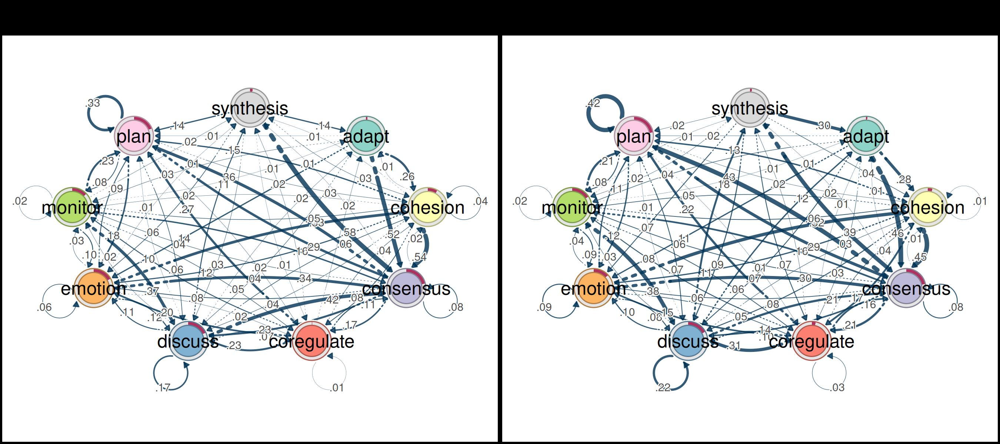
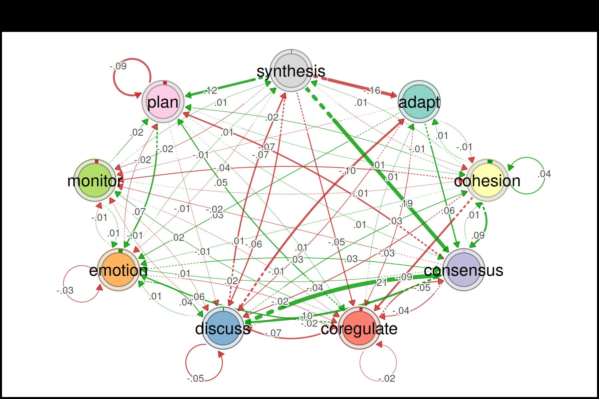
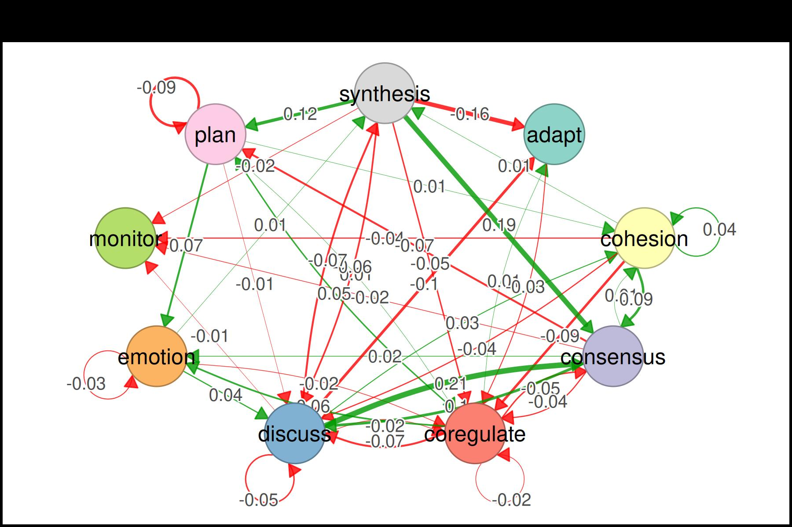
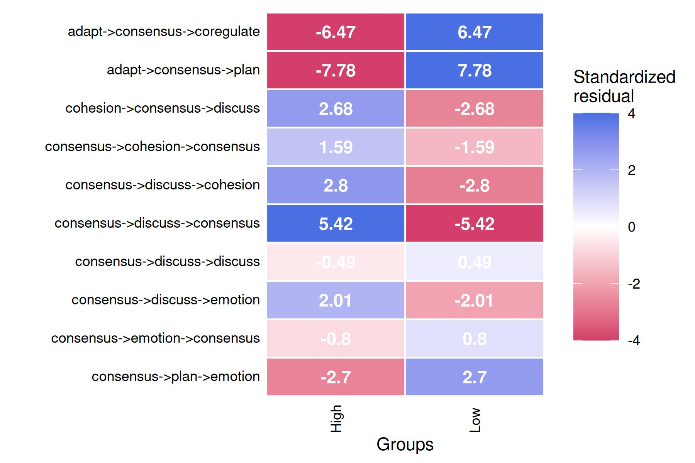
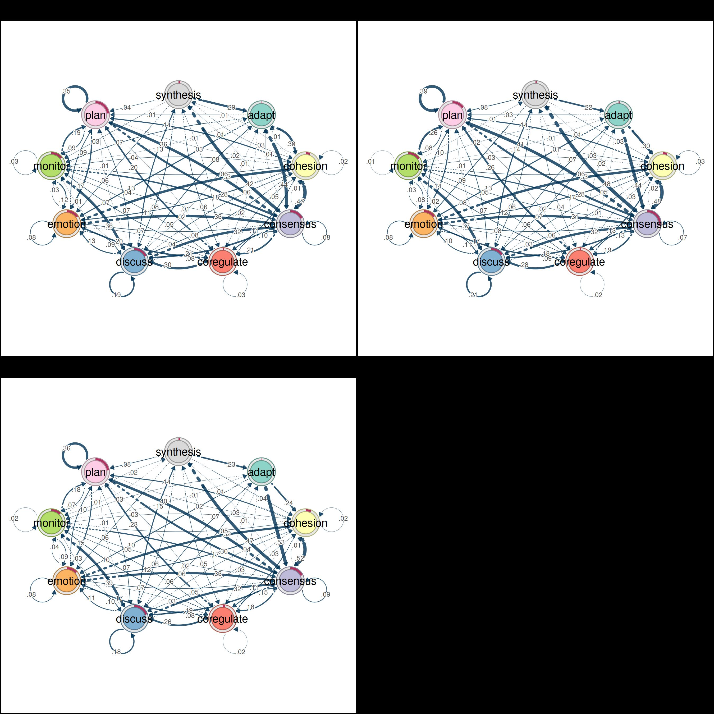
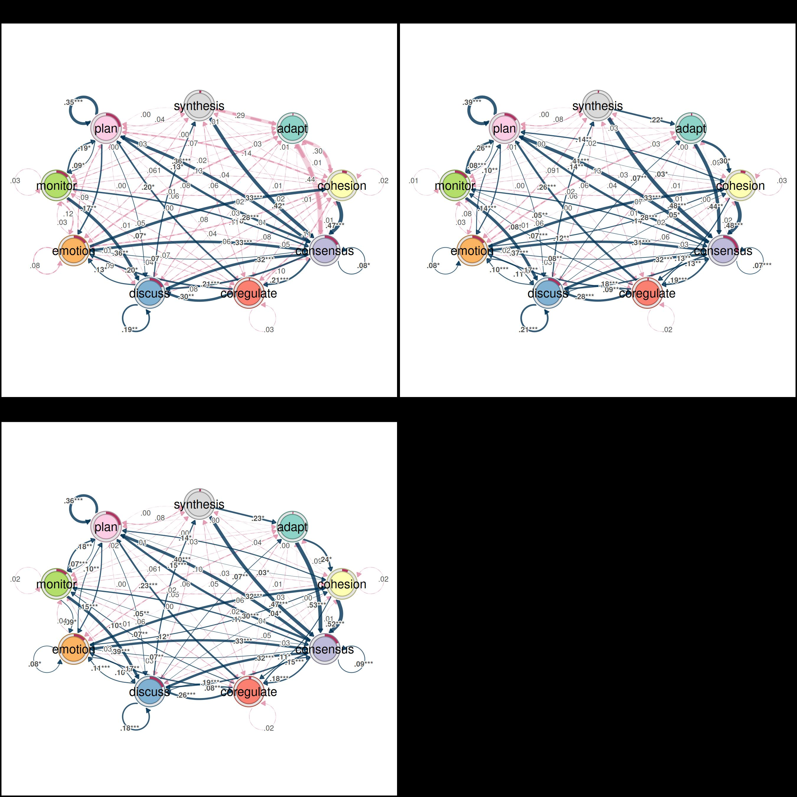
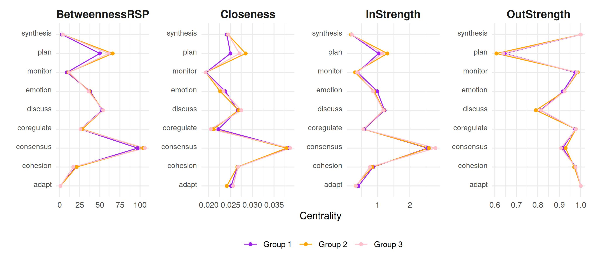
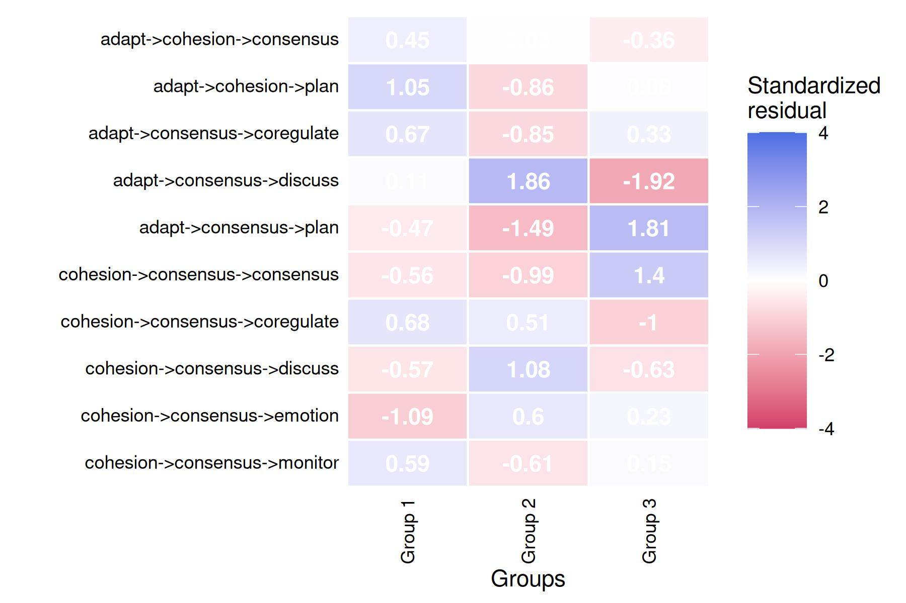

# Using grouped sequence data with tna

TNA supports the analysis of transition networks constructed from
grouped sequence data. Groups can be defined in several ways, but
mainly: using a pre-existing grouping variable in the data (e.g., a
demographic or experimental condition), or by clustering the sequences
themselves based on their similarity. This vignette demonstrates both
approaches using the `group_regulation_long` dataset.

First, we load the packages we will use for this example.

``` r
library("tna")
library("tibble")
library("dplyr")
library("gt")
library("seqHMM")
```

## Data preparation

We import the data in long format and prepare it for analysis. The
[`prepare_data()`](http://sonsoles.me/tna/reference/prepare_data.md)
function converts the long-format event log into wide-format sequences.
The unused columns in the dataset are stored in the metadata of
`prepared` and we can use them later on.

``` r
data("group_regulation_long", package = "tna")
prepared <- prepare_data(group_regulation_long,
                         actor = "Actor",
                         action = "Action",
                         time = "Time")
```

## Groups from a pre-existing variable

When the data contains a grouping variable, we can build separate TNA
models for each group directly. Here, the `"Achiever"` column in the
metadata splits the sequences into two groups (high vs. low achievers).

``` r
layout(t(1:2))
achievers <- group_tna(prepared, group = "Achiever")
plot(achievers)
```



### Comparing groups

The [`plot_compare()`](http://sonsoles.me/tna/reference/plot_compare.md)
function visualizes the difference network between the two groups. Green
edges and donut segments indicate that the first group (High achievers)
has higher values, while red indicates the opposite (Low achievers have
higher values).

``` r
plot_compare(achievers)
```



### Permutation test

A permutation test can be used to assess whether the observed
differences between the two groups are statistically significant.

``` r
permutation_test_results <- permutation_test(achievers)
plot(permutation_test_results)
```



### Subsequence comparison

We can also compare the frequency of subsequences across groups. Here we
look at subsequences of length 3 to 5, keeping only those that appear at
least 5 times, and apply FDR correction for multiple comparisons.

``` r
subsequence_comparison  <- compare_sequences(achievers,
                                                  sub = 3:5,
                                                  min_freq = 5,
                                                  correction = "fdr")
plot(subsequence_comparison, cells = TRUE)
```



## Groups from sequence clustering

When no pre-existing grouping variable is available, we can cluster the
sequences based on their pairwise dissimilarity. The
[`cluster_sequences()`](http://sonsoles.me/tna/reference/cluster_data.md).

``` r
clustering_results <- cluster_sequences(prepared, k = 3)
```

To choose an appropriate number of clusters, we can plot the silhouette
score for different values of *k*. Higher silhouette values indicate
better-separated clusters.

``` r
plot(
  2:8,
  sapply(2:8, \(k) cluster_sequences(prepared, k = k)$silhouette),
  type = "b",
  xlab = "Number of clusters (k)",
  ylab = "Silhouette",
  xaxt = "n"
)
```


Once we have chosen *k*, we build the grouped TNA model using the
cluster assignments.

``` r
tna_model_clus <- group_tna(prepared, group = clustering_results$assignments)
```

``` r
layout(matrix(1:4, byrow = T, ncol = 2))
plot(tna_model_clus)
```



### Summarizing the cluster-specific models

We can summarize the cluster-specific models to compare their overall
characteristics.

``` r
summary(tna_model_clus) |>
  gt() |>
  fmt_number(decimals = 2)
```

| metric                      | Group 1 | Group 2 | Group 3 |
|-----------------------------|---------|---------|---------|
| Node Count                  | 9.00    | 9.00    | 9.00    |
| Edge Count                  | 78.00   | 77.00   | 78.00   |
| Network Density             | 1.00    | 1.00    | 1.00    |
| Mean Distance               | 0.04    | 0.05    | 0.05    |
| Mean Out-Strength           | 1.00    | 1.00    | 1.00    |
| SD Out-Strength             | 0.75    | 0.80    | 0.84    |
| Mean In-Strength            | 1.00    | 1.00    | 1.00    |
| SD In-Strength              | 0.00    | 0.00    | 0.00    |
| Mean Out-Degree             | 8.67    | 8.56    | 8.67    |
| SD Out-Degree               | 0.71    | 0.73    | 0.71    |
| Centralization (Out-Degree) | 0.02    | 0.03    | 0.02    |
| Centralization (In-Degree)  | 0.02    | 0.03    | 0.02    |
| Reciprocity                 | 0.99    | 0.97    | 0.99    |

Initial probabilities show which states are most common at the start of
the sequences in each cluster.

``` r
mat <- sapply(
  tna_model_clus,
  \(x) setNames(x$inits, x$labels)
)

df <- data.frame(label = rownames(mat), mat, row.names = NULL)

gt(df, rowname_col = "label") |> fmt_percent(columns = -label)
```

|            | Group.1 | Group.2 | Group.3 |
|------------|---------|---------|---------|
| adapt      | 1.02%   | 1.41%   | 0.99%   |
| cohesion   | 5.73%   | 5.78%   | 6.92%   |
| consensus  | 17.96%  | 27.50%  | 18.18%  |
| coregulate | 1.53%   | 1.69%   | 2.77%   |
| discuss    | 17.83%  | 15.66%  | 19.76%  |
| emotion    | 15.67%  | 15.51%  | 13.83%  |
| monitor    | 14.52%  | 15.66%  | 12.45%  |
| plan       | 23.44%  | 15.23%  | 23.12%  |
| synthesis  | 2.29%   | 1.55%   | 1.98%   |

The full transition probability matrices can also be inspected for each
cluster.

``` r
transitions <- lapply(
  tna_model_clus,
  function(x) {
    x$weights |>
      data.frame() |>
      rownames_to_column("From\\To") |>
      gt() |>
      fmt_percent()
  }
)

transitions[[1]] |> tab_header(title = names(tna_model_clus)[1])
```

| Group 1    |        |          |           |            |         |         |         |        |           |
|------------|--------|----------|-----------|------------|---------|---------|---------|--------|-----------|
| From\To    | adapt  | cohesion | consensus | coregulate | discuss | emotion | monitor | plan   | synthesis |
| adapt      | 0.00%  | 30.34%   | 43.82%    | 2.25%      | 2.25%   | 13.48%  | 6.74%   | 1.12%  | 0.00%     |
| cohesion   | 0.70%  | 2.46%    | 47.37%    | 11.23%     | 8.42%   | 11.23%  | 3.86%   | 14.04% | 0.70%     |
| consensus  | 0.96%  | 1.17%    | 8.40%     | 21.04%     | 20.83%  | 6.59%   | 4.14%   | 35.60% | 1.28%     |
| coregulate | 1.44%  | 5.05%    | 10.47%    | 2.53%      | 30.32%  | 20.22%  | 6.86%   | 20.22% | 2.89%     |
| discuss    | 7.65%  | 5.81%    | 31.80%    | 7.65%      | 18.65%  | 12.54%  | 1.38%   | 1.07%  | 13.46%    |
| emotion    | 0.20%  | 33.47%   | 32.86%    | 3.63%      | 9.07%   | 8.27%   | 3.43%   | 8.67%  | 0.40%     |
| monitor    | 0.73%  | 5.84%    | 17.88%    | 5.47%      | 36.50%  | 12.04%  | 2.55%   | 18.61% | 0.36%     |
| plan       | 0.12%  | 1.88%    | 27.85%    | 1.29%      | 6.70%   | 17.39%  | 9.05%   | 35.49% | 0.24%     |
| synthesis  | 29.25% | 2.83%    | 42.45%    | 5.66%      | 7.55%   | 5.66%   | 2.83%   | 3.77%  | 0.00%     |

``` r
transitions[[2]] |> tab_header(title = names(tna_model_clus)[2])
```

| Group 2    |        |          |           |            |         |         |         |        |           |
|------------|--------|----------|-----------|------------|---------|---------|---------|--------|-----------|
| From\To    | adapt  | cohesion | consensus | coregulate | discuss | emotion | monitor | plan   | synthesis |
| adapt      | 0.00%  | 29.56%   | 43.84%    | 1.48%      | 6.90%   | 13.30%  | 1.97%   | 2.96%  | 0.00%     |
| cohesion   | 0.28%  | 3.05%    | 48.40%    | 12.62%     | 6.24%   | 11.65%  | 3.05%   | 14.29% | 0.42%     |
| consensus  | 0.39%  | 1.70%    | 7.07%     | 18.85%     | 17.84%  | 7.72%   | 4.71%   | 41.06% | 0.66%     |
| coregulate | 2.04%  | 3.24%    | 12.95%    | 2.28%      | 27.70%  | 16.79%  | 7.79%   | 25.78% | 1.44%     |
| discuss    | 6.96%  | 5.05%    | 31.85%    | 8.75%      | 20.89%  | 9.86%   | 1.85%   | 1.11%  | 13.68%    |
| emotion    | 0.43%  | 32.90%   | 30.91%    | 3.38%      | 10.91%  | 7.53%   | 3.20%   | 10.48% | 0.26%     |
| monitor    | 1.05%  | 5.62%    | 14.06%    | 5.80%      | 36.91%  | 7.56%   | 1.41%   | 26.19% | 1.41%     |
| plan       | 0.00%  | 2.61%    | 28.33%    | 1.86%      | 6.66%   | 13.59%  | 7.52%   | 39.28% | 0.15%     |
| synthesis  | 21.51% | 3.19%    | 48.21%    | 3.59%      | 5.98%   | 8.76%   | 0.40%   | 8.37%  | 0.00%     |

``` r
transitions[[3]] |> tab_header(title = names(tna_model_clus)[3])
```

| Group 3    |        |          |           |            |         |         |         |        |           |
|------------|--------|----------|-----------|------------|---------|---------|---------|--------|-----------|
| From\To    | adapt  | cohesion | consensus | coregulate | discuss | emotion | monitor | plan   | synthesis |
| adapt      | 0.00%  | 23.96%   | 53.00%    | 2.76%      | 6.45%   | 10.14%  | 3.23%   | 0.46%  | 0.00%     |
| cohesion   | 0.15%  | 2.47%    | 52.25%    | 11.47%     | 4.64%   | 11.61%  | 3.34%   | 13.93% | 0.15%     |
| consensus  | 0.39%  | 1.39%    | 9.18%     | 17.93%     | 19.01%  | 7.07%   | 4.79%   | 39.55% | 0.68%     |
| coregulate | 1.28%  | 3.49%    | 14.90%    | 2.33%      | 26.08%  | 16.65%  | 10.01%  | 23.28% | 1.98%     |
| discuss    | 7.11%  | 4.06%    | 32.50%    | 8.42%      | 18.46%  | 10.51%  | 2.93%   | 1.25%  | 14.76%    |
| emotion    | 0.08%  | 31.79%   | 32.80%    | 3.37%      | 9.95%   | 7.59%   | 4.13%   | 10.03% | 0.25%     |
| monitor    | 1.36%  | 5.42%    | 16.78%    | 5.93%      | 38.64%  | 9.15%   | 1.86%   | 18.47% | 2.37%     |
| plan       | 0.19%  | 2.63%    | 30.15%    | 1.72%      | 6.95%   | 14.92%  | 7.10%   | 36.15% | 0.19%     |
| synthesis  | 23.05% | 3.73%    | 46.78%    | 4.75%      | 6.10%   | 6.10%   | 1.36%   | 8.14%  | 0.00%     |

### Pruning with bootstrap

Just like ordinary TNA models, we can retain only the statistically
robust edges.

``` r
cluster_boot <- bootstrap(tna_model_clus)
```

``` r
layout(matrix(1:4, byrow = T, ncol = 2))
plot(cluster_boot)
```



### Centrality measures

Centrality measures can be computed for each cluster to identify which
states play central roles in each group’s transition dynamics.

``` r
centrality_measures <- c(
  "BetweennessRSP",
  "Closeness",
  "InStrength",
  "OutStrength"
)
centralities_per_cluster <- centralities(
  tna_model_clus,
  measures = centrality_measures
)
plot(
  centralities_per_cluster, ncol = 4,
  colors = c("purple", "orange", "pink")
)
```



### Subsequence comparison across clusters

Finally, we can compare subsequence frequencies across the clusters,
just as we did for the pre-existing groups above.

``` r
subsequence_comparison  <- compare_sequences(tna_model_clus, sub = 3:5, min_freq = 5, correction = "fdr")
plot(subsequence_comparison, cells = TRUE)
```


