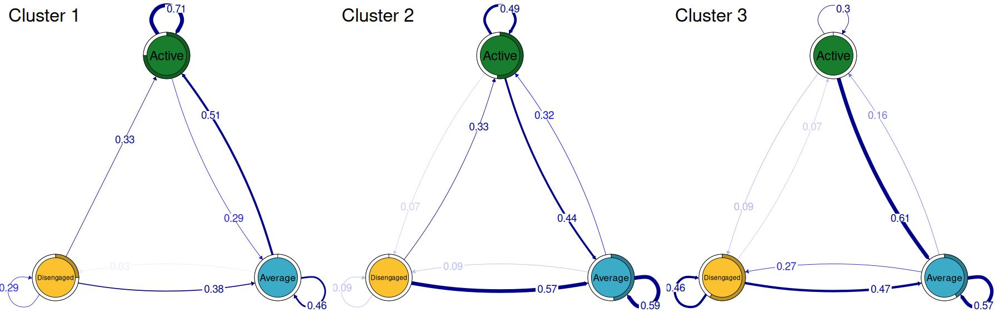
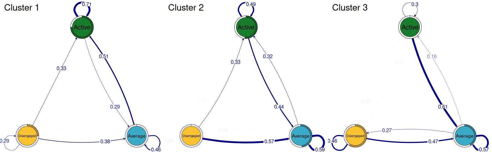
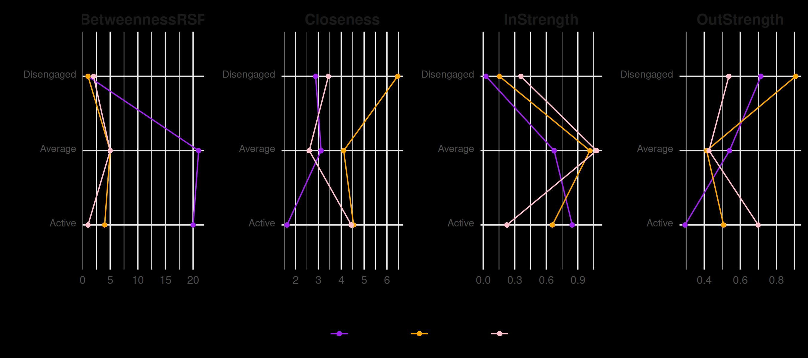

# Using grouped sequence data with tna

TNA also enables the analysis of transition networks constructed from
grouped sequence data. In this example, we first fit a mixed Markov
model to the `engagement` data using the `seqHMM` package and build a
grouped TNA model based on this model. First, we load the packages we
will use for this example.

``` r
library("tna")
library("tibble")
library("dplyr")
library("gt")
library("seqHMM")
data("engagement", package = "tna")
```

We simulate transition probabilities to initialize the model.

``` r
set.seed(265)
tna_model <- tna(engagement)
n_var <- length(tna_model$labels)
n_clusters <- 3
trans_probs <- simulate_transition_probs(n_var, n_clusters)
init_probs <- list(
  c(0.70, 0.20, 0.10),
  c(0.15, 0.70, 0.15),
  c(0.10, 0.20, 0.70)
)
```

Next, we build and fit the model (this step takes some time to compute,
the final model object is also available in the `tna` package as
`engagement_mmm`).

``` r
mmm <- build_mmm(
  engagement,
  transition_probs = trans_probs,
  initial_probs = init_probs
)
fit_mmm <- fit_model(
  modelTrans,
  global_step = TRUE,
  control_global = list(algorithm = "NLOPT_GD_STOGO_RAND"),
  local_step = TRUE,
  threads = 60,
  control_em = list(restart = list(times = 100, n_optimum = 101))
)
```

Now, we create a new model using the cluster information from the model.
Alternatively, if sequence data is provided to
[`group_model()`](http://sonsoles.me/tna/reference/group_model.md), the
group assignments can be provided with the `group` argument.

``` r
tna_model_clus <- group_model(fit_mmm$model)
```

We can summarize the cluster-specific models

``` r
summary(tna_model_clus) |>
  gt() |>
  fmt_number(decimals = 2)
```

| metric                      | Cluster 1 | Cluster 2 | Cluster 3 |
|-----------------------------|-----------|-----------|-----------|
| Node Count                  | 3.00      | 3.00      | 3.00      |
| Edge Count                  | 9.00      | 8.00      | 8.00      |
| Network Density             | 1.00      | 1.00      | 1.00      |
| Mean Distance               | 0.11      | 0.24      | 0.30      |
| Mean Out-Strength           | 1.00      | 1.00      | 1.00      |
| SD Out-Strength             | 0.21      | 0.35      | 0.47      |
| Mean In-Strength            | 1.00      | 1.00      | 1.00      |
| SD In-Strength              | 0.00      | 0.00      | 0.00      |
| Mean Out-Degree             | 3.00      | 2.67      | 2.67      |
| SD Out-Degree               | 0.00      | 0.58      | 0.58      |
| Centralization (Out-Degree) | 0.00      | 0.25      | 0.25      |
| Centralization (In-Degree)  | 0.00      | 0.25      | 0.25      |
| Reciprocity                 | 1.00      | 0.80      | 0.80      |

and their initial probabilities

``` r
bind_rows(lapply(tna_model_clus, \(x) x$inits), .id = "Cluster") |>
  gt() |>
  fmt_percent()
```

| Cluster 1 | Cluster 2 | Cluster 3 |
|-----------|-----------|-----------|
| 33.98%    | 75.00%    | 0.00%     |
| 32.35%    | 8.33%     | 0.00%     |
| 33.67%    | 16.67%    | 100.00%   |

as well as transition probabilities.

``` r
transitions <- lapply(
  tna_model_clus,
  function(x) {
    x$weights |>
      data.frame() |>
      rownames_to_column("From\\To") |>
      gt() |>
      tab_header(title = names(tna_model_clus)[1]) |>
      fmt_percent()
  }
)
transitions[[1]]
```

| Cluster 1  |        |         |            |
|------------|--------|---------|------------|
| From\To    | Active | Average | Disengaged |
| Active     | 85.99% | 8.92%   | 5.09%      |
| Average    | 31.21% | 54.21%  | 14.58%     |
| Disengaged | 4.79%  | 16.18%  | 79.03%     |

``` r
transitions[[2]]
```

| Cluster 1  |        |         |            |
|------------|--------|---------|------------|
| From\To    | Active | Average | Disengaged |
| Active     | 84.09% | 15.91%  | 0.00%      |
| Average    | 9.26%  | 62.96%  | 27.78%     |
| Disengaged | 15.56% | 51.11%  | 33.33%     |

``` r
transitions[[3]]
```

| Cluster 1  |        |         |            |
|------------|--------|---------|------------|
| From\To    | Active | Average | Disengaged |
| Active     | 58.33% | 12.50%  | 29.17%     |
| Average    | 15.28% | 81.94%  | 2.78%      |
| Disengaged | 0.00%  | 60.00%  | 40.00%     |

We can also plot the cluster-specific transitions

``` r
layout(t(1:3))
plot(tna_model_clus, vsize = 20, edge.label.cex = 2)
```



Just like ordinary TNA models, we can prune the rare transitions

``` r
pruned_clus <- prune(tna_model_clus, threshold = 0.1)
```

and plot the cluster transitions after pruning

``` r
layout(t(1:3))
plot(pruned_clus, vsize = 20, edge.label.cex = 2)
```



Centrality measures can also be computed for each cluster directly.

``` r
centrality_measures <- c(
  "BetweennessRSP",
  "Closeness",
  "InStrength",
  "OutStrength"
)
centralities_per_cluster <- centralities(
  tna_model_clus,
  measures = centrality_measures
)
plot(
  centralities_per_cluster, ncol = 4,
  colors = c("purple", "orange", "pink")
)
```


