# tna — R Package Documentation

------------------------------------------------------------------------

**tna** provides tools for performing Transition Network Analysis (TNA)
to study relational dynamics. Build Markov models from sequence data,
compute centrality measures, detect communities and cliques, and
validate findings with bootstrapping and permutation tests.

**Install:**

``` r
install.packages("tna")
# or dev version:
devtools::install_github("sonsoleslp/tna")
```

Requires R \>= 4.1.0. All analysis objects have
[`print()`](https://rdrr.io/r/base/print.html),
[`summary()`](https://rdrr.io/r/base/summary.html), and
[`plot()`](https://rdrr.io/r/graphics/plot.default.html) methods.

------------------------------------------------------------------------

## Building Models

### `build_model()`

Construct a transition network analysis model from sequence data.
Requires specifying `type`. For convenience, use the shortcut functions:
[`tna()`](http://sonsoles.me/tna/reference/build_model.md) = relative,
[`ftna()`](http://sonsoles.me/tna/reference/build_model.md) = frequency,
[`ctna()`](http://sonsoles.me/tna/reference/build_model.md) =
co-occurrence,
[`atna()`](http://sonsoles.me/tna/reference/build_model.md) = attention.

    build_model(x, type = "relative", scaling = character(0L), cols = everything(),
                params = list(), inits, begin_state, end_state)

| Parameter | Description                                                                                                 | Default                                      |
|-----------|-------------------------------------------------------------------------------------------------------------|----------------------------------------------|
| `x`       | `data.frame` (wide), `stslist`, `matrix`, or `tna_data`                                                     | —                                            |
| `type`    | `"relative"`, `"frequency"`, `"co-occurrence"`, `"n-gram"`, `"gap"`, `"window"`, `"reverse"`, `"attention"` | `"relative"`                                 |
| `scaling` | `"minmax"`, `"max"`, `"rank"`, or empty vector                                                              | `character(0)`                               |
| `params`  | List: `n_gram`, `max_gap`, `window_size`, `weighted`, `direction`, `decay`, `lambda`, `time`, `duration`    | [`list()`](https://rdrr.io/r/base/list.html) |

**Returns:** A `tna` object with `$weights`, `$inits`, `$labels`,
`$data`.

``` r
# Using build_model with explicit type
model <- build_model(group_regulation, type = "relative")

# Shortcut functions (preferred)
model <- tna(group_regulation)       # type = "relative"
model_f <- ftna(group_regulation)    # type = "frequency"
model_c <- ctna(group_regulation)    # type = "co-occurrence"
model_a <- atna(group_regulation)    # type = "attention"

print(model)
```

    #> State Labels : 
    #> 
    #>    adapt, cohesion, consensus, coregulate, discuss, emotion, monitor, plan, synthesis 
    #> 
    #> Transition Probability Matrix :
    #> 
    #>                   adapt   cohesion  consensus coregulate    discuss    emotion
    #> adapt      0.0000000000 0.27308448 0.47740668 0.02161100 0.05893910 0.11984283
    #> cohesion   0.0029498525 0.02713864 0.49793510 0.11917404 0.05958702 0.11563422
    #> consensus  0.0047400853 0.01485227 0.08200348 0.18770738 0.18802338 0.07268131
    #> coregulate 0.0162436548 0.03604061 0.13451777 0.02335025 0.27360406 0.17208122
    #> discuss    0.0713743356 0.04758289 0.32118451 0.08428246 0.19488737 0.10579600
    #> emotion    0.0024673951 0.32534367 0.32040888 0.03419105 0.10186817 0.07684173
    #> monitor    0.0111653873 0.05582694 0.15910677 0.05792045 0.37543615 0.09071877
    #> plan       0.0009745006 0.02517460 0.29040117 0.01721618 0.06789021 0.14682475
    #> synthesis  0.2346625767 0.03374233 0.46625767 0.04447853 0.06288344 0.07055215
    #>               monitor       plan   synthesis
    #> adapt      0.03339882 0.01571709 0.000000000
    #> cohesion   0.03303835 0.14100295 0.003539823
    #> consensus  0.04661084 0.39579712 0.007584137
    #> coregulate 0.08629442 0.23908629 0.018781726
    #> discuss    0.02227284 0.01164262 0.140976968
    #> emotion    0.03630596 0.09975326 0.002819880
    #> monitor    0.01814375 0.21563154 0.016050244
    #> plan       0.07552379 0.37420822 0.001786584
    #> synthesis  0.01226994 0.07515337 0.000000000
    #> 
    #> Initial Probabilities : 
    #> 
    #>      adapt   cohesion  consensus coregulate    discuss    emotion    monitor 
    #>     0.0115     0.0605     0.2140     0.0190     0.1755     0.1515     0.1440 
    #>       plan  synthesis 
    #>     0.2045     0.0195

``` r
summary(model)
```

    #> # A tibble: 13 × 2
    #>    metric                         value
    #>  * <chr>                          <dbl>
    #>  1 Node Count                  9   e+ 0
    #>  2 Edge Count                  7.8 e+ 1
    #>  3 Network Density             1   e+ 0
    #>  4 Mean Distance               4.72e- 2
    #>  5 Mean Out-Strength           1   e+ 0
    #>  6 SD Out-Strength             8.07e- 1
    #>  7 Mean In-Strength            1   e+ 0
    #>  8 SD In-Strength              6.80e-17
    #>  9 Mean Out-Degree             8.67e+ 0
    #> 10 SD Out-Degree               7.07e- 1
    #> 11 Centralization (Out-Degree) 1.56e- 2
    #> 12 Centralization (In-Degree)  1.56e- 2
    #> 13 Reciprocity                 9.86e- 1

#### Model types

| Type              | Description                                       |
|-------------------|---------------------------------------------------|
| `"relative"`      | Transition probabilities (rows sum to 1). Default |
| `"frequency"`     | Raw transition counts                             |
| `"co-occurrence"` | Co-occurrence within sequences                    |
| `"n-gram"`        | Higher-order transitions                          |
| `"gap"`           | Non-adjacent transitions, weighted by gap         |
| `"window"`        | Transitions within sliding window                 |
| `"reverse"`       | Reverse order (reply networks)                    |
| `"attention"`     | Exponential decay-weighted downstream pairs       |

### `group_model()` / `group_tna()`

Build a TNA model for each group. Accepts manual group assignments,
`mhmm` objects, or `tna_clustering` results. Most tna functions accept
`group_tna` directly — no need to specify groups again.

    group_model(x, group, type = "relative", scaling = character(0L),
                groupwise = FALSE, cols = everything(), params = list(), na.rm = TRUE, ...)

``` r
# From mixture Markov model
mmm_model <- group_model(engagement_mmm)
print(mmm_model)
```

    #> Cluster 1 :
    #> State Labels : 
    #> 
    #>    Active, Average, Disengaged 
    #> 
    #> Transition Probability Matrix :
    #> 
    #>                Active    Average Disengaged
    #> Active     0.85985688 0.08919748 0.05094565
    #> Average    0.31210322 0.54208478 0.14581200
    #> Disengaged 0.04791061 0.16179397 0.79029542
    #> 
    #> Initial Probabilities : 
    #> 
    #>     Active    Average Disengaged 
    #>  0.3397762  0.3234995  0.3367243 
    #> 
    #> Cluster 2 :
    #> State Labels : 
    #> 
    #>    Active, Average, Disengaged 
    #> 
    #> Transition Probability Matrix :
    #> 
    #>                Active   Average Disengaged
    #> Active     0.84090909 0.1590909  0.0000000
    #> Average    0.09259259 0.6296296  0.2777778
    #> Disengaged 0.15555556 0.5111111  0.3333333
    #> 
    #> Initial Probabilities : 
    #> 
    #>     Active    Average Disengaged 
    #> 0.75000000 0.08333333 0.16666667 
    #> 
    #> Cluster 3 :
    #> State Labels : 
    #> 
    #>    Active, Average, Disengaged 
    #> 
    #> Transition Probability Matrix :
    #> 
    #>               Active   Average Disengaged
    #> Active     0.5833333 0.1250000 0.29166667
    #> Average    0.1527778 0.8194444 0.02777778
    #> Disengaged 0.0000000 0.6000000 0.40000000
    #> 
    #> Initial Probabilities : 
    #> 
    #>     Active    Average Disengaged 
    #>          0          0          1

``` r
summary(mmm_model)
```

    #> # A tibble: 13 × 4
    #>    metric                      `Cluster 1` `Cluster 2` `Cluster 3`
    #>  * <chr>                             <dbl>       <dbl>       <dbl>
    #>  1 Node Count                        3           3           3    
    #>  2 Edge Count                        9           8           8    
    #>  3 Network Density                   1           1           1    
    #>  4 Mean Distance                     0.111       0.239       0.302
    #>  5 Mean Out-Strength                 1           1           1    
    #>  6 SD Out-Strength                   0.214       0.353       0.472
    #>  7 Mean In-Strength                  1           1           1    
    #>  8 SD In-Strength                    0           0           0    
    #>  9 Mean Out-Degree                   3           2.67        2.67 
    #> 10 SD Out-Degree                     0           0.577       0.577
    #> 11 Centralization (Out-Degree)       0           0.25        0.25 
    #> 12 Centralization (In-Degree)        0           0.25        0.25 
    #> 13 Reciprocity                       1           0.8         0.8

``` r
# Manual groups
group <- c(rep("High", 1000), rep("Low", 1000))
gmodel <- group_model(group_regulation, group = group)
```

### `sna()`

Build a social network analysis model from edge-list data (from, to,
weight).

``` r
set.seed(42)
d <- data.frame(
  from = sample(LETTERS[1:4], 100, replace = TRUE),
  to = sample(LETTERS[1:4], 100, replace = TRUE),
  weight = rexp(100)
)
model_sna <- sna(d)
```

------------------------------------------------------------------------

## Plotting

All TNA analysis objects have
[`plot()`](https://rdrr.io/r/graphics/plot.default.html) methods
returning `cograph_network` or `ggplot2` objects.

### `plot()`

Plot a TNA model as a transition network.

    plot(x, labels, colors, pie, cut, show_pruned = TRUE, pruned_edge_color = "pink",
         edge.color = NA, edge.labels = TRUE, edge.label.position = 0.65,
         layout = "circle", layout_args = list(), scale_nodes, scaling_factor = 0.5,
         mar = rep(5, 4), theme = "colorblind", ...)

``` r
plot(model)
```

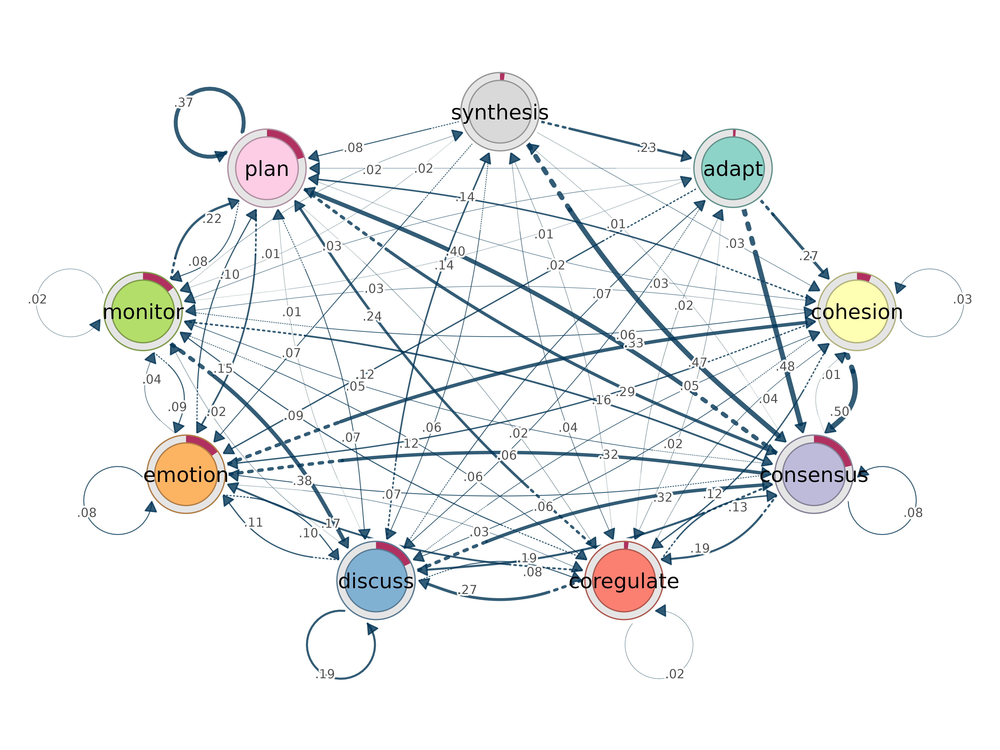

``` r
plot(model, layout = "spring", scale_nodes = "OutStrength")
```

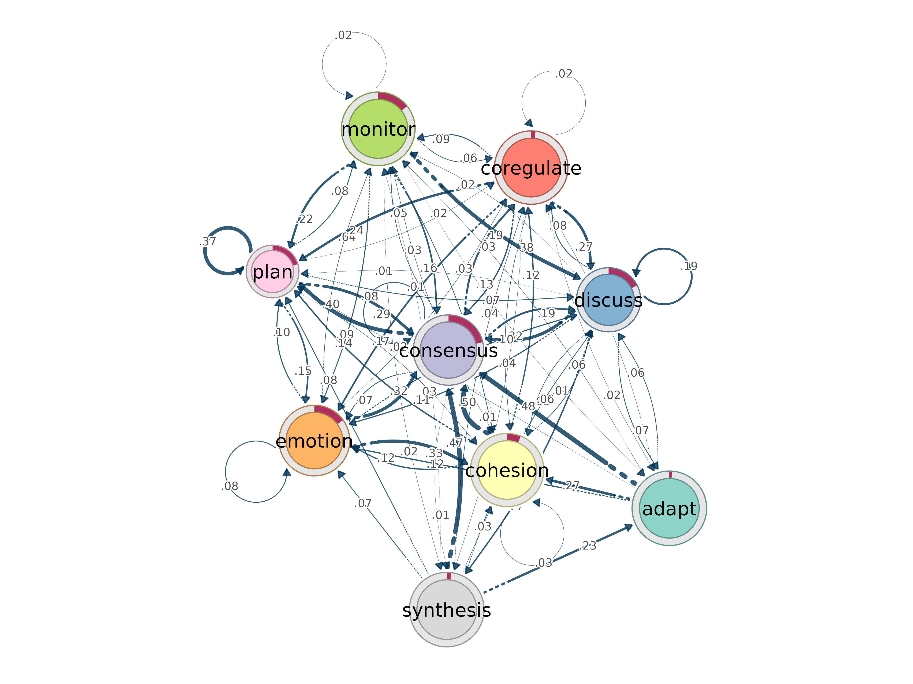

``` r
layout(t(1:2))
# Group model — side-by-side panels
plot(gmodel)
```

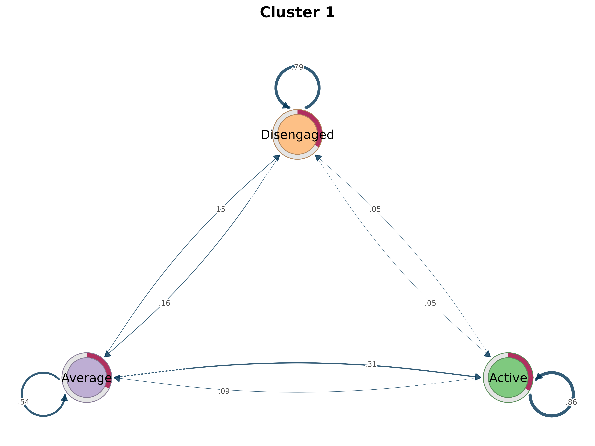

### `plot_frequencies()`

Bar plot of state frequency distribution.

``` r
plot_frequencies(model)
```

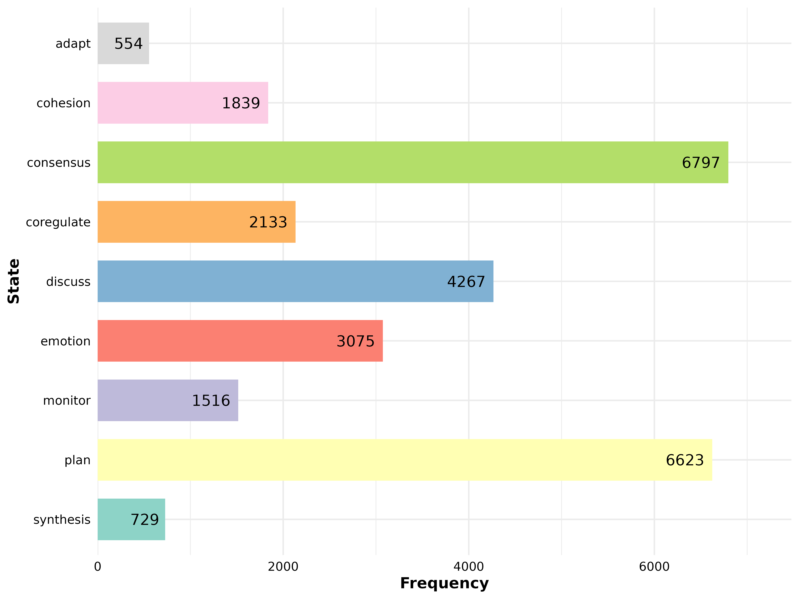

``` r
# Group comparison
plot_frequencies(gmodel)
```

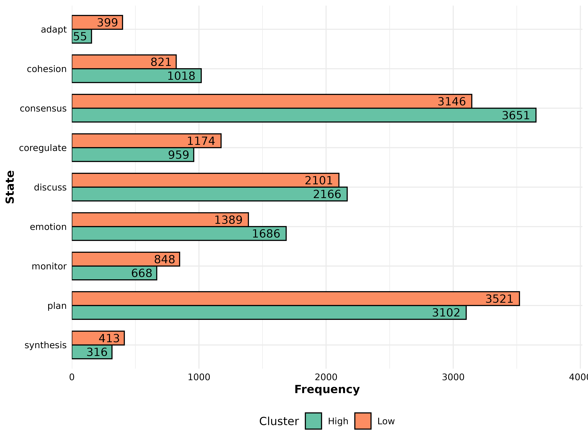

### `plot_mosaic()`

Mosaic plot with chi-square test results. Requires frequency model
([`ftna()`](http://sonsoles.me/tna/reference/build_model.md)).

``` r
plot_mosaic(model_f)
```

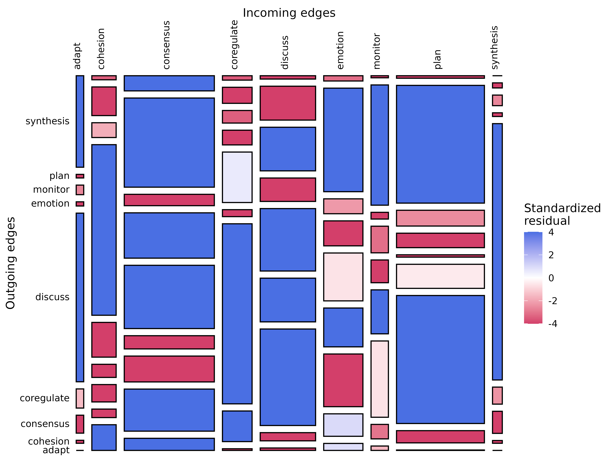

### `plot_sequences()`

Sequence index plots or state distribution plots.

    plot_sequences(x, cols = everything(), group, type = "index", scale = "proportion",
                   geom = "bar", include_na = FALSE, colors, na_color = "white",
                   sort_by, show_n = TRUE, border, title, legend_title, xlab, ylab,
                   tick = 5, ncol = 2L, ...)

``` r
plot_sequences(group_regulation)
```

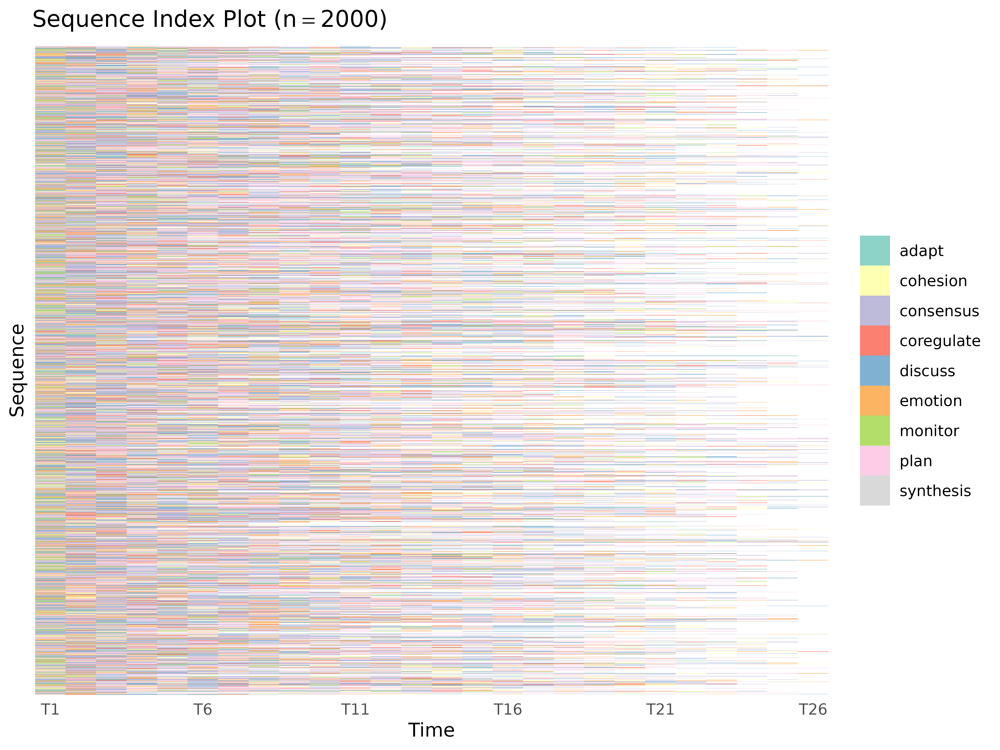

``` r
plot_sequences(group_regulation, type = "distribution")
```

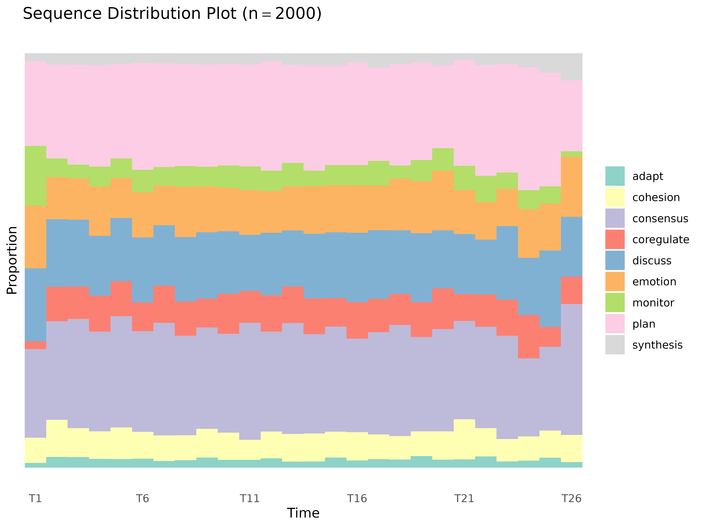

``` r
# Group comparison — pass group_tna directly
plot_sequences(gmodel)
```

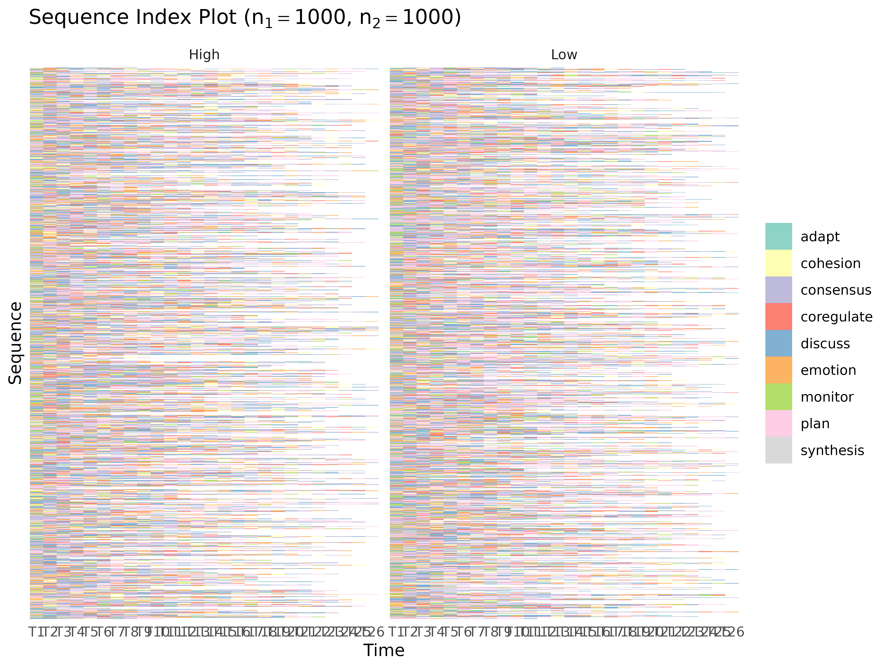

### `plot_compare()`

Difference network between groups. Just pass the group model object.

``` r
plot_compare(gmodel)
```

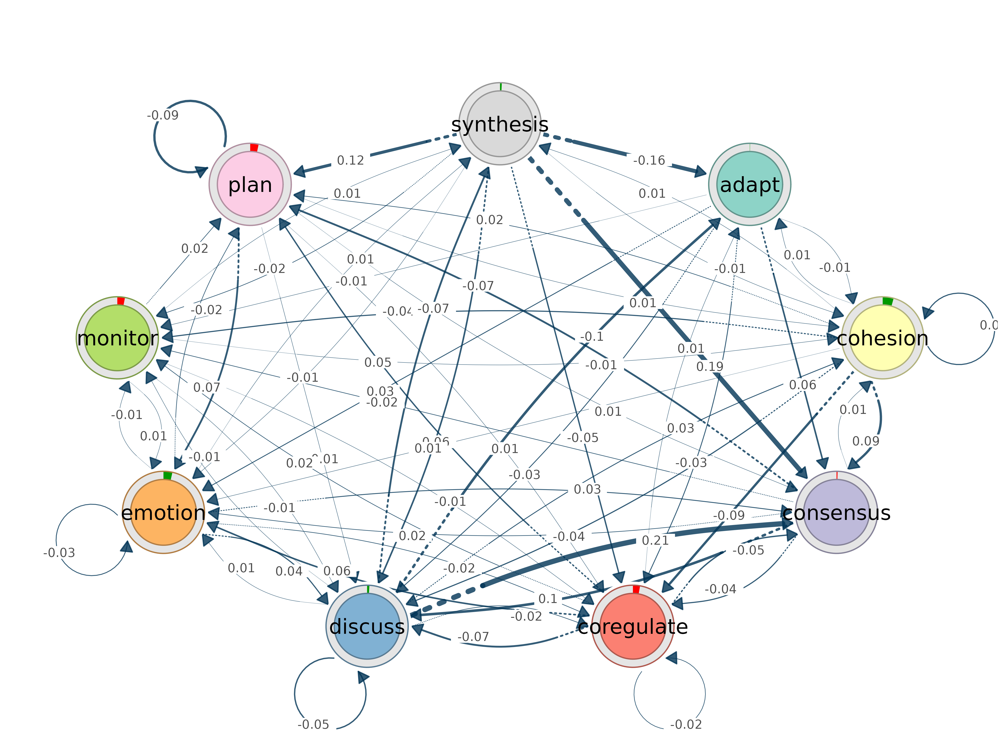

Difference network between two models. Green = x greater, red = y
greater.

``` r
model_a <- tna(group_regulation[1:1000, ])
model_b <- tna(group_regulation[1001:2000, ])
plot_compare(model_a, model_b)
```

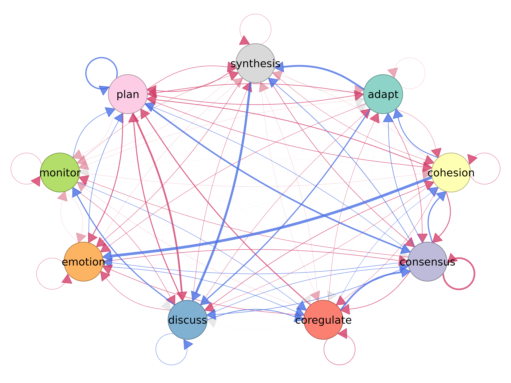

### `plot_associations()`

Association network. Requires frequency model
([`ftna()`](http://sonsoles.me/tna/reference/build_model.md)).

``` r
plot_associations(model_f)
```

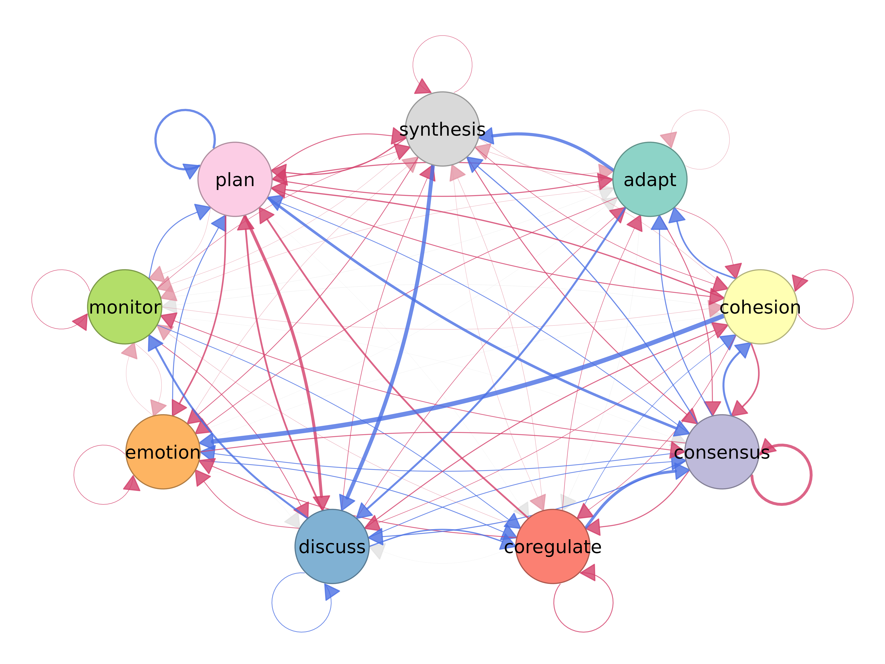

### `hist()`

``` r
hist(model)
```

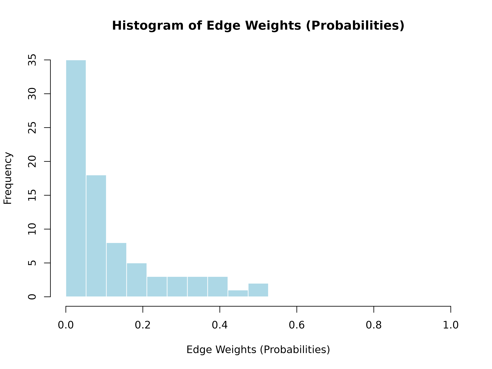

#### Additional plot methods

| Object                    | plot() produces                       |
|---------------------------|---------------------------------------|
| `tna_centralities`        | Lollipop charts by measure            |
| `tna_communities`         | Network colored by community          |
| `tna_cliques`             | Individual clique subnetworks         |
| `tna_bootstrap`           | Significant edges only                |
| `tna_permutation`         | Significant edge differences          |
| `tna_stability`           | Stability curves with CS-coefficients |
| `tna_comparison`          | Heatmap or difference viz             |
| `tna_sequence_comparison` | Pattern comparison chart              |
| `group_tna`               | Side-by-side network plots            |

------------------------------------------------------------------------

## Data Preparation

### `prepare_data()`

Convert long-format event logs into wide-format sequences.

    prepare_data(data, actor, time, action, order, time_threshold = 900,
                 custom_format = NULL, is_unix_time = FALSE,
                 unix_time_unit = "seconds", unused_fn = dplyr::first)

``` r
results <- prepare_data(
  group_regulation_long,
  actor = "Actor", time = "Time", action = "Action"
)
print(results$statistics)
```

    #> $total_sessions
    #> [1] 2000
    #> 
    #> $total_actions
    #> [1] 27533
    #> 
    #> $max_sequence_length
    #> [1] 26
    #> 
    #> $unique_users
    #> [1] 2000
    #> 
    #> $sessions_per_user
    #> # A tibble: 2,000 × 2
    #>    Actor n_sessions
    #>    <int>      <int>
    #>  1     1          1
    #>  2     2          1
    #>  3     3          1
    #>  4     4          1
    #>  5     5          1
    #>  6     6          1
    #>  7     7          1
    #>  8     8          1
    #>  9     9          1
    #> 10    10          1
    #> # ℹ 1,990 more rows
    #> 
    #> $actions_per_session
    #> # A tibble: 2,000 × 2
    #>    .session_id   n_actions
    #>    <chr>             <int>
    #>  1 1010 session1        26
    #>  2 1015 session1        26
    #>  3 1030 session1        26
    #>  4 1092 session1        26
    #>  5 1106 session1        26
    #>  6 1107 session1        26
    #>  7 1153 session1        26
    #>  8 1184 session1        26
    #>  9 1209 session1        26
    #> 10 1267 session1        26
    #> # ℹ 1,990 more rows
    #> 
    #> $time_range
    #> [1] "2025-01-01 08:01:16 UTC" "2025-01-01 13:03:20 UTC"

### `import_data()`

Transform wide-format feature data into long-format sequence data.

    import_data(data, cols, id_cols, window_size = 1, replace_zeros = TRUE)

### `import_onehot()`

Import one-hot encoded data as co-occurrence network.

    import_onehot(data, cols, window = 1L)

### `simulate()`

Simulate sequence data from a TNA model (requires `type = "relative"`).

``` r
sim <- simulate(model, nsim = 5, seed = 123, max_len = 10)
print(sim)
```

    #>         T1         T2        T3      T4        T5       T6         T7
    #> 1     plan    emotion consensus monitor consensus  discuss  synthesis
    #> 2  monitor    emotion      plan    plan   emotion     plan  consensus
    #> 3     plan       plan      plan discuss   discuss cohesion coregulate
    #> 4  monitor coregulate      plan    plan      plan     plan    monitor
    #> 5 cohesion  consensus consensus    plan      plan  monitor    emotion
    #>           T8         T9       T10
    #> 1      adapt       plan      plan
    #> 2    discuss   cohesion consensus
    #> 3       plan  consensus      plan
    #> 4 coregulate  consensus      plan
    #> 5  consensus coregulate   monitor

------------------------------------------------------------------------

## Centrality Measures

### `centralities()`

Calculate centrality measures. Works on `tna`, `group_tna`, and
`matrix`.

    centralities(x, loops = FALSE, normalize = FALSE, measures)

| Measure                                      | Description                           |
|----------------------------------------------|---------------------------------------|
| `OutStrength`                                | Total weight of outgoing edges        |
| `InStrength`                                 | Total weight of incoming edges        |
| `ClosenessIn` / `ClosenessOut` / `Closeness` | Closeness centrality variants         |
| `Betweenness`                                | Geodesic betweenness                  |
| `BetweennessRSP`                             | Randomized shortest paths betweenness |
| `Diffusion`                                  | Diffusion centrality                  |
| `Clustering`                                 | Signed clustering coefficient         |

``` r
cm <- centralities(model)
print(cm)
```

    #> # A tibble: 9 × 10
    #>   state    OutStrength InStrength ClosenessIn ClosenessOut Closeness Betweenness
    #> * <fct>          <dbl>      <dbl>       <dbl>        <dbl>     <dbl>       <dbl>
    #> 1 adapt          1          0.345     0.00834       0.0152    0.0248           1
    #> 2 cohesion       0.973      0.812     0.0138        0.0124    0.0265           0
    #> 3 consens…       0.918      2.67      0.0351        0.0125    0.0383          30
    #> 4 coregul…       0.977      0.567     0.0155        0.0150    0.0210           0
    #> 5 discuss        0.805      1.19      0.0196        0.0131    0.0271          16
    #> 6 emotion        0.923      0.894     0.0141        0.0121    0.0231           5
    #> 7 monitor        0.982      0.346     0.00758       0.0137    0.0193           0
    #> 8 plan           0.626      1.19      0.0274        0.0115    0.0274           9
    #> 9 synthes…       1          0.192     0.00997       0.0158    0.0243           7
    #> # ℹ 3 more variables: BetweennessRSP <dbl>, Diffusion <dbl>, Clustering <dbl>

``` r
plot(cm, ncol = 3, reorder = TRUE)
```

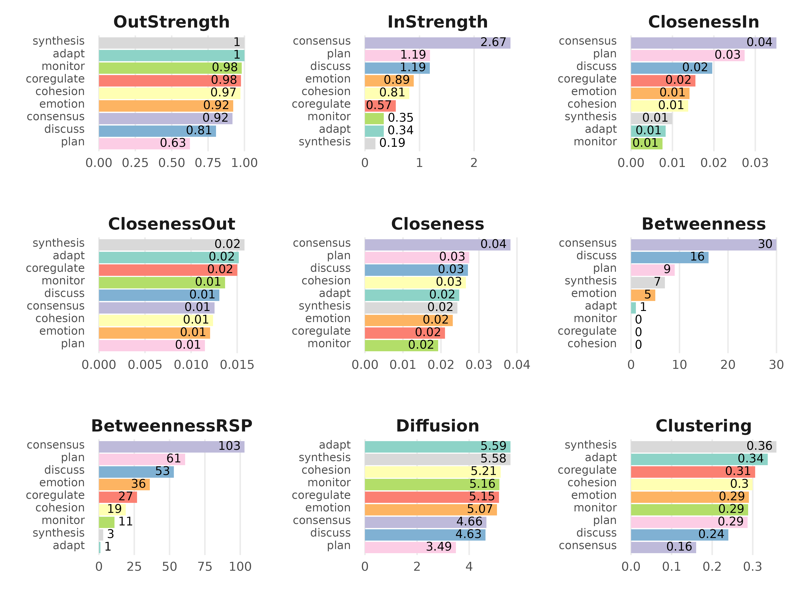

``` r
# On group_tna directly
centralities(gmodel)
```

    #> # A tibble: 18 × 11
    #>    group state      OutStrength InStrength ClosenessIn ClosenessOut Closeness
    #>  * <chr> <fct>            <dbl>      <dbl>       <dbl>        <dbl>     <dbl>
    #>  1 High  adapt            1          0.215     0.00650       0.0154    0.0263
    #>  2 High  cohesion         0.956      0.815     0.0142        0.0118    0.0279
    #>  3 High  consensus        0.917      2.95      0.0386        0.0121    0.0408
    #>  4 High  coregulate       0.987      0.436     0.0151        0.0139    0.0205
    #>  5 High  discuss          0.831      1.12      0.0224        0.0124    0.0309
    #>  6 High  emotion          0.937      1.00      0.0159        0.0115    0.0254
    #>  7 High  monitor          0.981      0.301     0.00768       0.0130    0.0209
    #>  8 High  plan             0.672      1.27      0.0282        0.0113    0.0283
    #>  9 High  synthesis        1          0.167     0.00878       0.0153    0.0273
    #> 10 Low   adapt            1          0.452     0.00948       0.0146    0.0242
    #> 11 Low   cohesion         0.993      0.799     0.0132        0.0123    0.0252
    #> 12 Low   consensus        0.920      2.42      0.0321        0.0119    0.0352
    #> 13 Low   coregulate       0.968      0.689     0.0160        0.0155    0.0218
    #> 14 Low   discuss          0.779      1.21      0.0158        0.0129    0.0223
    #> 15 Low   emotion          0.906      0.808     0.0128        0.0118    0.0209
    #> 16 Low   monitor          0.982      0.393     0.00743       0.0142    0.0183
    #> 17 Low   plan             0.585      1.15      0.0261        0.0109    0.0261
    #> 18 Low   synthesis        1          0.216     0.0101        0.0153    0.0233
    #> # ℹ 4 more variables: Betweenness <dbl>, BetweennessRSP <dbl>, Diffusion <dbl>,
    #> #   Clustering <dbl>

### `betweenness_network()`

Build network with edge betweenness as weights.

``` r
bn <- betweenness_network(model)
print(bn)
```

    #> State Labels : 
    #> 
    #>    adapt, cohesion, consensus, coregulate, discuss, emotion, monitor, plan, synthesis 
    #> 
    #> Edge Betweenness Matrix :
    #> 
    #>            adapt cohesion consensus coregulate discuss emotion monitor plan
    #> adapt          0        2         6          0       0       1       0    0
    #> cohesion       0        0         7          0       0       1       0    0
    #> consensus      0        0         0          8      15       0       0   15
    #> coregulate     0        0         0          0       4       2       1    1
    #> discuss        0        0         7          0       0       2       0    0
    #> emotion        0        6         7          0       0       0       0    0
    #> monitor        0        0         0          0       5       2       0    1
    #> plan           0        0         5          0       0       5       7    0
    #> synthesis      9        0         6          0       0       0       0    0
    #>            synthesis
    #> adapt              0
    #> cohesion           0
    #> consensus          0
    #> coregulate         0
    #> discuss           15
    #> emotion            0
    #> monitor            0
    #> plan               0
    #> synthesis          0
    #> 
    #> Initial Probabilities : 
    #> 
    #>      adapt   cohesion  consensus coregulate    discuss    emotion    monitor 
    #>     0.0115     0.0605     0.2140     0.0190     0.1755     0.1515     0.1440 
    #>       plan  synthesis 
    #>     0.2045     0.0195

### `estimate_cs()`

Centrality stability via subset sampling.

    estimate_cs(x, loops = FALSE, normalize = FALSE,
                measures = c("InStrength", "OutStrength", "Betweenness"),
                iter = 1000, method = "pearson",
                drop_prop = seq(0.1, 0.9, by = 0.1),
                threshold = 0.7, certainty = 0.95, progressbar = FALSE)

``` r
cs <- estimate_cs(model, measures = c("InStrength", "OutStrength"), iter = 100)
print(cs)
```

    #> Centrality Stability Coefficients
    #> 
    #>  InStrength OutStrength 
    #>         0.9         0.9

``` r
plot(cs)
```

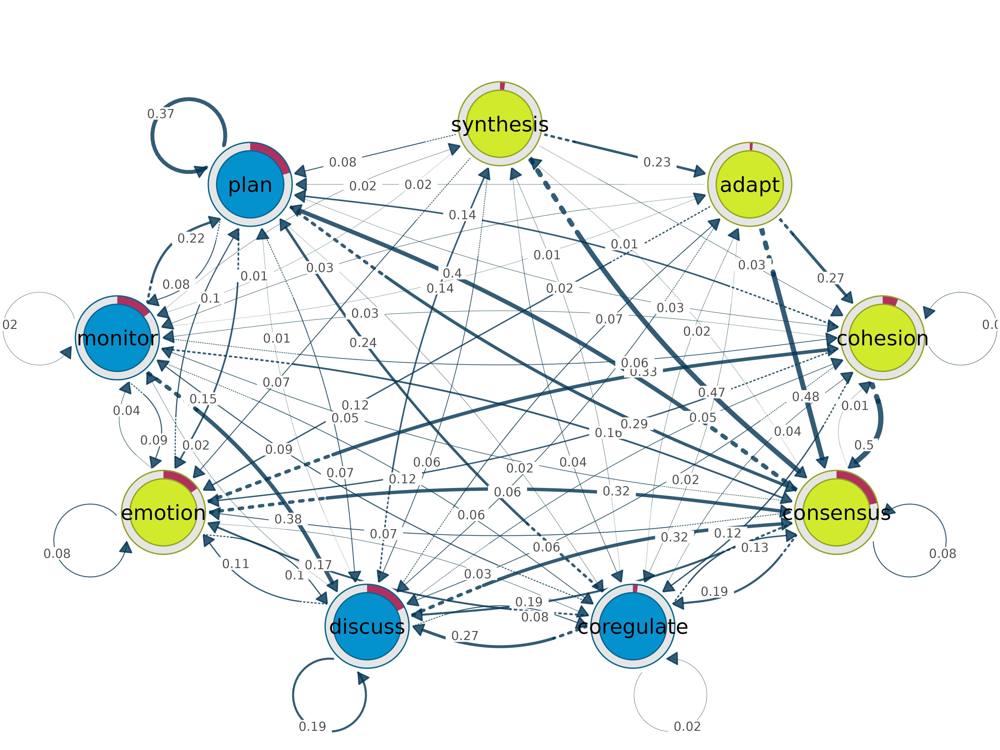

------------------------------------------------------------------------

## Network Structure

### `communities()`

Detect communities using 7 igraph algorithms. Works on `tna` and
`group_tna`.

    communities(x, methods, gamma = 1)

``` r
comm <- communities(model)
print(comm)
```

    #> Number of communities found by each algorithm
    #> 
    #>         walktrap      fast_greedy       label_prop          infomap 
    #>                1                3                1                1 
    #> edge_betweenness    leading_eigen        spinglass 
    #>                1                3                2 
    #> 
    #> Community assignments
    #> 
    #>        state walktrap fast_greedy label_prop infomap edge_betweenness
    #> 1      adapt        1           1          1       1                1
    #> 2   cohesion        1           1          1       1                1
    #> 3  consensus        1           1          1       1                1
    #> 4 coregulate        1           2          1       1                1
    #> 5    discuss        1           2          1       1                1
    #> 6    emotion        1           1          1       1                1
    #> 7    monitor        1           2          1       1                1
    #> 8       plan        1           3          1       1                1
    #> 9  synthesis        1           1          1       1                1
    #>   leading_eigen spinglass
    #> 1             1         1
    #> 2             1         1
    #> 3             2         1
    #> 4             3         2
    #> 5             3         2
    #> 6             1         1
    #> 7             2         2
    #> 8             2         2
    #> 9             3         1

``` r
plot(comm, method = "spinglass")
```

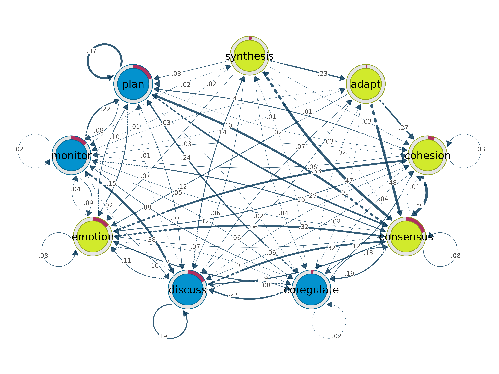

``` r
# On group_tna directly
communities(gmodel)
```

    #> High :
    #> Number of communities found by each algorithm
    #> 
    #>         walktrap      fast_greedy       label_prop          infomap 
    #>                2                3                1                1 
    #> edge_betweenness    leading_eigen        spinglass 
    #>                7                2                2 
    #> 
    #> Community assignments
    #> 
    #>        state walktrap fast_greedy label_prop infomap edge_betweenness
    #> 1      adapt        1           1          1       1                1
    #> 2   cohesion        1           1          1       1                2
    #> 3  consensus        1           1          1       1                1
    #> 4 coregulate        2           2          1       1                3
    #> 5    discuss        2           2          1       1                4
    #> 6    emotion        1           1          1       1                5
    #> 7    monitor        2           2          1       1                6
    #> 8       plan        2           3          1       1                7
    #> 9  synthesis        1           1          1       1                1
    #>   leading_eigen spinglass
    #> 1             1         2
    #> 2             1         2
    #> 3             1         2
    #> 4             2         1
    #> 5             1         1
    #> 6             1         2
    #> 7             2         1
    #> 8             2         1
    #> 9             1         2
    #> 
    #> Low :
    #> Number of communities found by each algorithm
    #> 
    #>         walktrap      fast_greedy       label_prop          infomap 
    #>                1                3                1                1 
    #> edge_betweenness    leading_eigen        spinglass 
    #>                3                4                3 
    #> 
    #> Community assignments
    #> 
    #>        state walktrap fast_greedy label_prop infomap edge_betweenness
    #> 1      adapt        1           1          1       1                1
    #> 2   cohesion        1           3          1       1                1
    #> 3  consensus        1           1          1       1                1
    #> 4 coregulate        1           2          1       1                1
    #> 5    discuss        1           2          1       1                2
    #> 6    emotion        1           3          1       1                1
    #> 7    monitor        1           2          1       1                3
    #> 8       plan        1           1          1       1                3
    #> 9  synthesis        1           1          1       1                1
    #>   leading_eigen spinglass
    #> 1             1         2
    #> 2             1         1
    #> 3             2         1
    #> 4             3         3
    #> 5             3         3
    #> 6             4         1
    #> 7             3         3
    #> 8             2         1
    #> 9             1         2

### `cliques()`

Identify cliques (complete subgraphs) of a given size.

    cliques(x, size = 2, threshold = 0, sum_weights = FALSE, ...)

``` r
layout(t(1:3))
cliq <- cliques(model, size = 2)
print(cliq)
```

    #> Number of 2-cliques = 35 (weight threshold = 0)
    #> Showing 6 cliques starting from clique number 1
    #> 
    #> Clique 1
    #>            monitor      plan
    #> monitor 0.01814375 0.2156315
    #> plan    0.07552379 0.3742082
    #> 
    #> Clique 2
    #>            emotion    monitor
    #> emotion 0.07684173 0.03630596
    #> monitor 0.09071877 0.01814375
    #> 
    #> Clique 3
    #>            emotion       plan
    #> emotion 0.07684173 0.09975326
    #> plan    0.14682475 0.37420822
    #> 
    #> Clique 4
    #>           discuss    emotion
    #> discuss 0.1948874 0.10579600
    #> emotion 0.1018682 0.07684173
    #> 
    #> Clique 5
    #>           discuss    monitor
    #> discuss 0.1948874 0.02227284
    #> monitor 0.3754361 0.01814375
    #> 
    #> Clique 6
    #>            discuss       plan
    #> discuss 0.19488737 0.01164262
    #> plan    0.06789021 0.37420822

``` r
plot(cliq, n = 3, ask = FALSE)
```

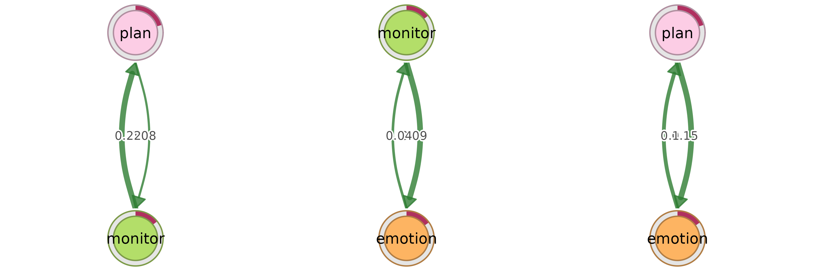

------------------------------------------------------------------------

## Comparison

### `compare()`

Compare two TNA models with comprehensive metrics.

``` r
comp <- compare(gmodel, i = 1, j = 2)
print(comp)
```

    #> Edge difference metrics
    #> # A tibble: 81 × 16
    #>    source     target   weight_x weight_y raw_difference absolute_difference
    #>    <fct>      <fct>       <dbl>    <dbl>          <dbl>               <dbl>
    #>  1 adapt      adapt     0       0              0                   0       
    #>  2 cohesion   adapt     0.00533 0              0.00533             0.00533 
    #>  3 consensus  adapt     0.00413 0.00545       -0.00132             0.00132 
    #>  4 coregulate adapt     0.0224  0.0112         0.0112              0.0112  
    #>  5 discuss    adapt     0.0240  0.120         -0.0962              0.0962  
    #>  6 emotion    adapt     0.00323 0.00155        0.00167             0.00167 
    #>  7 monitor    adapt     0.0111  0.0112        -0.000192            0.000192
    #>  8 plan       adapt     0.00138 0.000613       0.000771            0.000771
    #>  9 synthesis  adapt     0.144   0.302         -0.158               0.158   
    #> 10 adapt      cohesion  0.262   0.277         -0.0148              0.0148  
    #> # ℹ 71 more rows
    #> # ℹ 10 more variables: squared_difference <dbl>, relative_difference <dbl>,
    #> #   similarity_strength_index <dbl>, difference_index <dbl>,
    #> #   rank_difference <dbl>, percentile_difference <dbl>,
    #> #   logarithmic_ratio <dbl>, standardized_weight_x <dbl>,
    #> #   standardized_weight_y <dbl>, standardized_score_inflation <dbl>
    #> 
    #> Summary metrics of differences
    #> # A tibble: 22 × 3
    #>    category          metric                value
    #>    <chr>             <chr>                 <dbl>
    #>  1 Weight Deviations Mean Abs. Diff.      0.0322
    #>  2 Weight Deviations Median Abs. Diff.    0.0181
    #>  3 Weight Deviations RMS Diff.            0.0522
    #>  4 Weight Deviations Max Abs. Diff.       0.210 
    #>  5 Weight Deviations Rel. Mean Abs. Diff. 0.290 
    #>  6 Weight Deviations CV Ratio             1.10  
    #>  7 Correlations      Pearson              0.921 
    #>  8 Correlations      Spearman             0.915 
    #>  9 Correlations      Kendall              0.767 
    #> 10 Correlations      Distance             0.838 
    #> # ℹ 12 more rows
    #> 
    #> Network metrics
    #> # A tibble: 13 × 3
    #>    metric                             x        y
    #>    <chr>                          <dbl>    <dbl>
    #>  1 Node Count                  9   e+ 0 9   e+ 0
    #>  2 Edge Count                  7.6 e+ 1 7.5 e+ 1
    #>  3 Network Density             1   e+ 0 1   e+ 0
    #>  4 Mean Distance               4.23e- 2 5.60e- 2
    #>  5 Mean Out-Strength           1   e+ 0 1   e+ 0
    #>  6 SD Out-Strength             9.14e- 1 7.19e- 1
    #>  7 Mean In-Strength            1   e+ 0 1   e+ 0
    #>  8 SD In-Strength              7.85e-17 3.93e-17
    #>  9 Mean Out-Degree             8.44e+ 0 8.33e+ 0
    #> 10 SD Out-Degree               1.13e+ 0 8.66e- 1
    #> 11 Centralization (Out-Degree) 4.69e- 2 6.25e- 2
    #> 12 Centralization (In-Degree)  4.69e- 2 6.25e- 2
    #> 13 Reciprocity                 9.57e- 1 9.41e- 1

``` r
plot(comp)
```

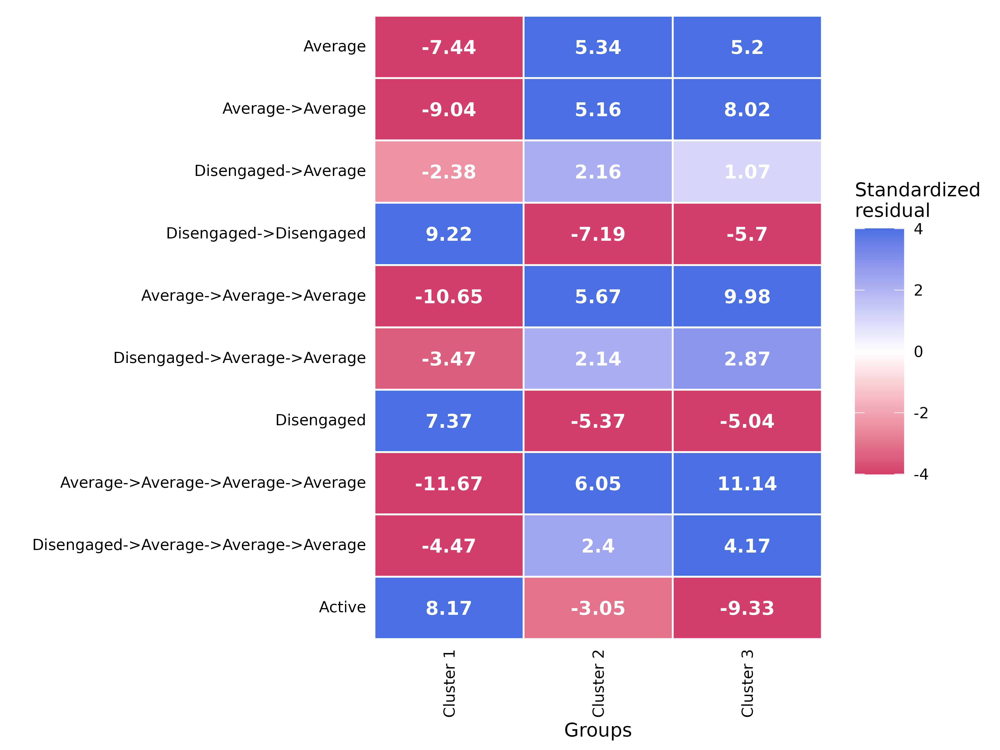

### `compare_sequences()`

Compare subsequence patterns between groups. Pass `group_tna` directly.

    # For group_tna (groups already defined)
    compare_sequences(x, sub, min_freq = 5L, correction = "bonferroni", ...)

``` r
comp_seq <- compare_sequences(gmodel)
print(head(comp_seq, 10))
```

    #>             pattern freq_High freq_Low   prop_High    prop_Low effect_size
    #> 1             adapt       155      399 0.011296553 0.028887924   16.476066
    #> 2          cohesion      1018      821 0.074192843 0.059441066    7.135478
    #> 3         consensus      3651     3146 0.266088478 0.227772951   14.333771
    #> 4        coregulate       959     1174 0.069892865 0.084998552    6.781559
    #> 5           emotion      1686     1389 0.122877341 0.100564726    9.109850
    #> 6           monitor       668      848 0.048684498 0.061395888    6.804318
    #> 7              plan      3102     3521 0.226076817 0.254923255    6.307583
    #> 8         synthesis       316      413 0.023030391 0.029901535    4.689000
    #> 9   adapt->cohesion        37      102 0.002908576 0.007961286    8.232879
    #> 10 adapt->consensus        73      170 0.005738543 0.013268810    9.106178
    #>        p_value
    #> 1  0.008991009
    #> 2  0.008991009
    #> 3  0.008991009
    #> 4  0.008991009
    #> 5  0.008991009
    #> 6  0.008991009
    #> 7  0.008991009
    #> 8  0.008991009
    #> 9  0.077922078
    #> 10 0.077922078

``` r
plot(comp_seq)
```

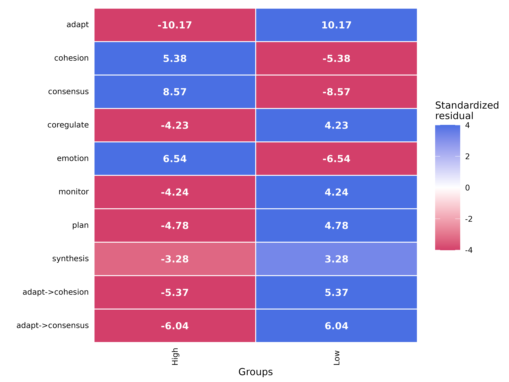

### `permutation_test()`

Permutation tests for edge weight and centrality differences.

    permutation_test(x, y, adjust = "none", iter = 1000, paired = FALSE,
                     level = 0.05, measures = character(0), ...)

``` r
model_x <- tna(group_regulation[1:200, ])
model_y <- tna(group_regulation[1001:1200, ])
perm <- permutation_test(model_x, model_y, iter = 100)
print(perm)
```

    #> # A tibble: 81 × 4
    #>    edge_name           diff_true effect_size p_value
    #>    <chr>                   <dbl>       <dbl>   <dbl>
    #>  1 adapt -> adapt       0            NaN     1      
    #>  2 cohesion -> adapt    0.00541        0.949 0.802  
    #>  3 consensus -> adapt  -0.000679      -0.175 0.752  
    #>  4 coregulate -> adapt  0.00769        0.568 0.624  
    #>  5 discuss -> adapt    -0.130         -7.11  0.00990
    #>  6 emotion -> adapt     0.0101         1.59  0.257  
    #>  7 monitor -> adapt    -0.00480       -0.367 0.970  
    #>  8 plan -> adapt        0.00339        1.56  0.0297 
    #>  9 synthesis -> adapt  -0.159         -2.08  0.0594 
    #> 10 adapt -> cohesion   -0.0907        -1.23  0.238  
    #> # ℹ 71 more rows

``` r
plot(perm)
```

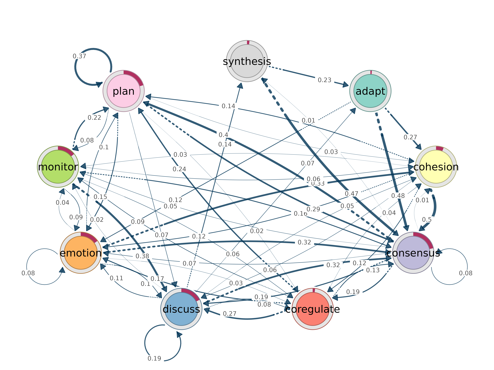

It also accepts a group tna model object.

``` r
permg <- permutation_test(gmodel, iter = 100)
```

------------------------------------------------------------------------

## Validation

### `bootstrap()`

Bootstrap transition networks for confidence intervals and significance.

    bootstrap(x, iter = 1000, level = 0.05, method = "stability",
              threshold, consistency_range = c(0.75, 1.25))

``` r
boot <- bootstrap(model, iter = 100)
plot(boot)
```

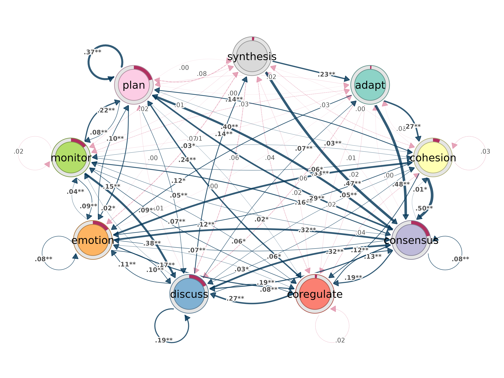

``` r
plot_bootstrap_forest(boot)
```

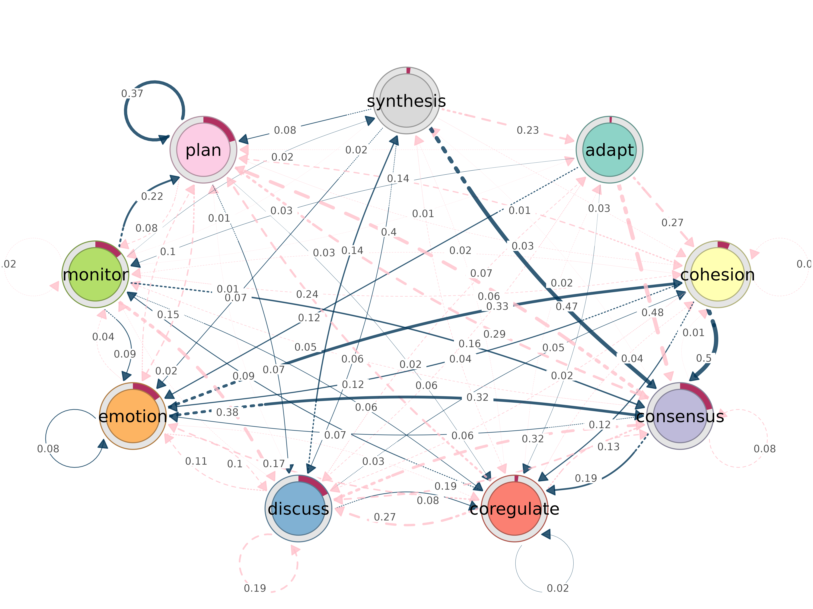

### `bootstrap_cliques()`

Bootstrap cliques to assess stability.

``` r
bc <- bootstrap_cliques(model, size = 2, iter = 100)
print(bc)
```

### `prune()`

Remove weak edges. Four methods available.

    prune(x, method = "threshold", threshold = 0.1, lowest = 0.05,
          level = 0.5, boot = NULL, ...)

``` r
pruned_t <- prune(model, method = "threshold", threshold = 0.1)
pruned_p <- prune(model, method = "lowest", lowest = 0.05)
pruned_d <- prune(model, method = "disparity", level = 0.5)
pruning_details(pruned_t)
```

``` r
plot(pruned_t)
```

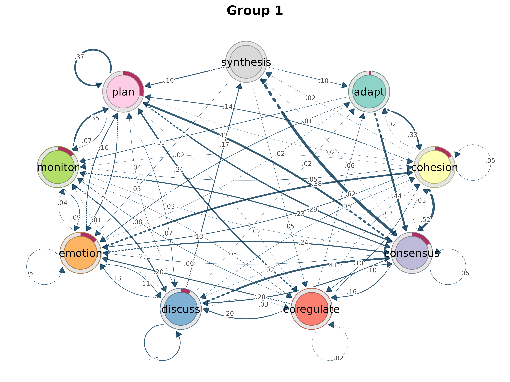

``` r
# Restore and reapply
restored <- deprune(pruned_t)
repruned <- reprune(restored)
```

------------------------------------------------------------------------

## Clustering

### `cluster_sequences()`

Cluster sequences using string distance-based dissimilarity.

    cluster_sequences(data, k, dissimilarity = "hamming", method = "pam",
                      na_syms = c("*", "%"), weighted = FALSE, lambda = 1, ...)

``` r
result <- cluster_sequences(group_regulation[1:200, ], k = 3, dissimilarity = "osa")
print(result)
```

    #> Clustering method: pam 
    #> Number of clusters: 3 
    #> Silhouette score: 0.1678702 
    #> Cluster sizes:
    #>  1  2  3 
    #> 63 66 71

``` r
# Pass directly to group_model
gmodel_clust <- group_model(result)
plot(gmodel_clust)
```

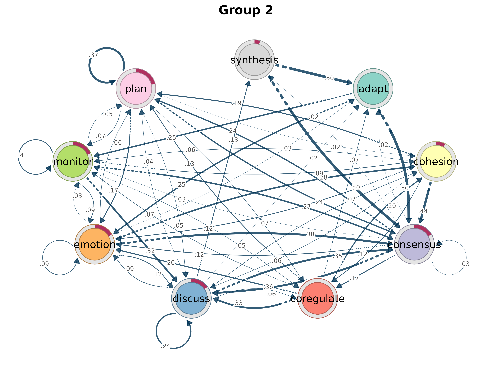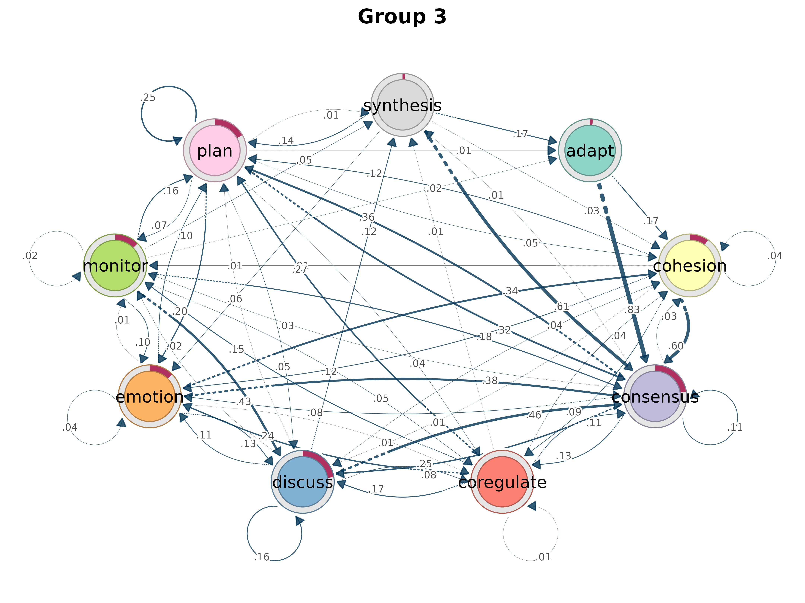

### `rename_groups()`

``` r
gmodel_mmm <- group_model(engagement_mmm)
gmodel_mmm_renamed <- rename_groups(gmodel_mmm, c("A", "B", "C"))
cat("Original:", names(group_model(engagement_mmm)), "\n")
```

    #> Original: Cluster 1 Cluster 2 Cluster 3

``` r
cat("Renamed:", names(gmodel_mmm_renamed), "\n")
```

    #> Renamed: A B C

### `mmm_stats()`

``` r
mmm_stats(engagement_mmm)
```

    #>     cluster    variable  estimate std_error  ci_lower  ci_upper   z_value
    #> 1 Cluster 2 (Intercept) -2.640329 0.1274911 -2.890207 -2.390451 -20.70991
    #> 2 Cluster 3 (Intercept) -4.512131 0.3157501 -5.130990 -3.893272 -14.29020
    #>   p_value
    #> 1       0
    #> 2       0

------------------------------------------------------------------------

## Summary & Conversion

### `summary()`

``` r
summary(model)
```

    #> # A tibble: 13 × 2
    #>    metric                         value
    #>  * <chr>                          <dbl>
    #>  1 Node Count                  9   e+ 0
    #>  2 Edge Count                  7.8 e+ 1
    #>  3 Network Density             1   e+ 0
    #>  4 Mean Distance               4.72e- 2
    #>  5 Mean Out-Strength           1   e+ 0
    #>  6 SD Out-Strength             8.07e- 1
    #>  7 Mean In-Strength            1   e+ 0
    #>  8 SD In-Strength              6.80e-17
    #>  9 Mean Out-Degree             8.67e+ 0
    #> 10 SD Out-Degree               7.07e- 1
    #> 11 Centralization (Out-Degree) 1.56e- 2
    #> 12 Centralization (In-Degree)  1.56e- 2
    #> 13 Reciprocity                 9.86e- 1

``` r
summary(gmodel)
```

    #> # A tibble: 13 × 3
    #>    metric                          High      Low
    #>  * <chr>                          <dbl>    <dbl>
    #>  1 Node Count                  9   e+ 0 9   e+ 0
    #>  2 Edge Count                  7.6 e+ 1 7.5 e+ 1
    #>  3 Network Density             1   e+ 0 1   e+ 0
    #>  4 Mean Distance               4.23e- 2 5.60e- 2
    #>  5 Mean Out-Strength           1   e+ 0 1   e+ 0
    #>  6 SD Out-Strength             9.14e- 1 7.19e- 1
    #>  7 Mean In-Strength            1   e+ 0 1   e+ 0
    #>  8 SD In-Strength              7.85e-17 3.93e-17
    #>  9 Mean Out-Degree             8.44e+ 0 8.33e+ 0
    #> 10 SD Out-Degree               1.13e+ 0 8.66e- 1
    #> 11 Centralization (Out-Degree) 4.69e- 2 6.25e- 2
    #> 12 Centralization (In-Degree)  4.69e- 2 6.25e- 2
    #> 13 Reciprocity                 9.57e- 1 9.41e- 1

### `as.igraph()`

``` r
g <- as.igraph(model)
print(g)
```

    #> IGRAPH d2938bc DNW- 9 78 -- 
    #> + attr: name (v/c), weight (e/n)
    #> + edges from d2938bc (vertex names):
    #>  [1] adapt     ->cohesion   adapt     ->consensus  adapt     ->coregulate
    #>  [4] adapt     ->discuss    adapt     ->emotion    adapt     ->monitor   
    #>  [7] adapt     ->plan       cohesion  ->adapt      cohesion  ->cohesion  
    #> [10] cohesion  ->consensus  cohesion  ->coregulate cohesion  ->discuss   
    #> [13] cohesion  ->emotion    cohesion  ->monitor    cohesion  ->plan      
    #> [16] cohesion  ->synthesis  consensus ->adapt      consensus ->cohesion  
    #> [19] consensus ->consensus  consensus ->coregulate consensus ->discuss   
    #> [22] consensus ->emotion    consensus ->monitor    consensus ->plan      
    #> + ... omitted several edges

------------------------------------------------------------------------

**tna** v1.1.0 \| MIT License \| Mohammed Saqr, Santtu Tikka, Sonsoles
Lopez-Pernas

Reference: Saqr M., Lopez-Pernas S., et al. (2025). Transition Network
Analysis. *Proc. LAK ’25*, 351-361.
[doi:10.1145/3706468.3706513](https://doi.org/10.1145/3706468.3706513)
