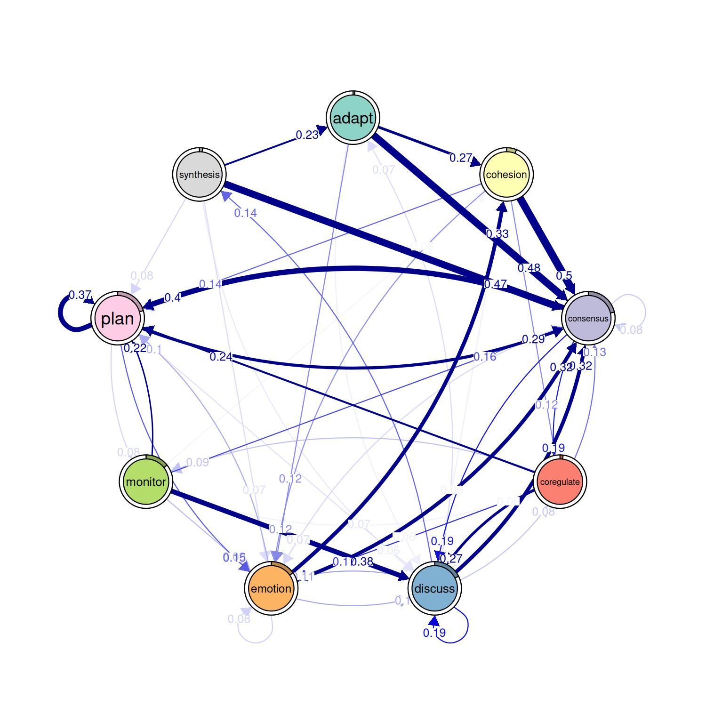
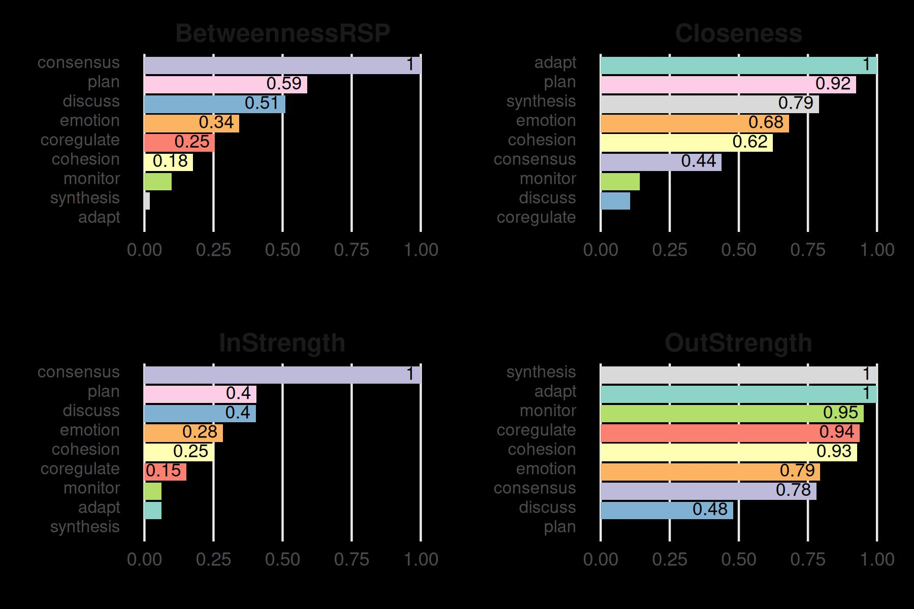

# Getting started with the tna package

This vignette showcases some basic usage of the `tna` package. For more
tutorials, please visit [the package website](https://sonsoles.me/tna/).

First we load the package that we will use for this example.

``` r
library("tna")
library("tibble")
library("dplyr")
library("gt")
```

We also load the `group_regulation` data available in the package (see
[`?group_regulation`](http://sonsoles.me/tna/reference/group_regulation.md)
for further information)

``` r
data("group_regulation", package = "tna")
```

We build a TNA model using this data with the
[`tna()`](http://sonsoles.me/tna/reference/build_model.md) function .

``` r
tna_model <- tna(group_regulation)
```

To visualize the model, we can use the standard
[`plot()`](https://rdrr.io/r/graphics/plot.default.html) function.

``` r
plot(
  tna_model, cut = 0.2, minimum = 0.05, 
  edge.label.position = 0.8, edge.label.cex = 0.7
)
```



The initial state probabilities are

``` r
data.frame(`Initial prob.` = tna_model$inits, check.names = FALSE) |>
  rownames_to_column("Action") |>
  arrange(desc(`Initial prob.`)) |>
  gt() |>
  fmt_percent()
```

| Action     | Initial prob. |
|------------|---------------|
| consensus  | 21.40%        |
| plan       | 20.45%        |
| discuss    | 17.55%        |
| emotion    | 15.15%        |
| monitor    | 14.40%        |
| cohesion   | 6.05%         |
| synthesis  | 1.95%         |
| coregulate | 1.90%         |
| adapt      | 1.15%         |

and the transitions probabilities are

``` r
tna_model$weights |>
  data.frame() |>
  rownames_to_column("From\\To") |>
  gt() |>
  fmt_percent()
```

| From\To    | adapt  | cohesion | consensus | coregulate | discuss | emotion | monitor | plan   | synthesis |
|------------|--------|----------|-----------|------------|---------|---------|---------|--------|-----------|
| adapt      | 0.00%  | 27.31%   | 47.74%    | 2.16%      | 5.89%   | 11.98%  | 3.34%   | 1.57%  | 0.00%     |
| cohesion   | 0.29%  | 2.71%    | 49.79%    | 11.92%     | 5.96%   | 11.56%  | 3.30%   | 14.10% | 0.35%     |
| consensus  | 0.47%  | 1.49%    | 8.20%     | 18.77%     | 18.80%  | 7.27%   | 4.66%   | 39.58% | 0.76%     |
| coregulate | 1.62%  | 3.60%    | 13.45%    | 2.34%      | 27.36%  | 17.21%  | 8.63%   | 23.91% | 1.88%     |
| discuss    | 7.14%  | 4.76%    | 32.12%    | 8.43%      | 19.49%  | 10.58%  | 2.23%   | 1.16%  | 14.10%    |
| emotion    | 0.25%  | 32.53%   | 32.04%    | 3.42%      | 10.19%  | 7.68%   | 3.63%   | 9.98%  | 0.28%     |
| monitor    | 1.12%  | 5.58%    | 15.91%    | 5.79%      | 37.54%  | 9.07%   | 1.81%   | 21.56% | 1.61%     |
| plan       | 0.10%  | 2.52%    | 29.04%    | 1.72%      | 6.79%   | 14.68%  | 7.55%   | 37.42% | 0.18%     |
| synthesis  | 23.47% | 3.37%    | 46.63%    | 4.45%      | 6.29%   | 7.06%   | 1.23%   | 7.52%  | 0.00%     |

The function
[`centralities()`](http://sonsoles.me/tna/reference/centralities.md) can
be used to compute various centrality measures (see
[`?centralities`](http://sonsoles.me/tna/reference/centralities.md) for
more information). These measures can also be visualized with the
[`plot()`](https://rdrr.io/r/graphics/plot.default.html) function.

``` r
centrality_measures <- c("BetweennessRSP", "Closeness", "InStrength", "OutStrength")
cents_withoutloops <- centralities(
  tna_model,
  measures = centrality_measures,
  loops = FALSE,
  normalize = TRUE
)
plot(cents_withoutloops, ncol = 2, model = tna_model)
```


