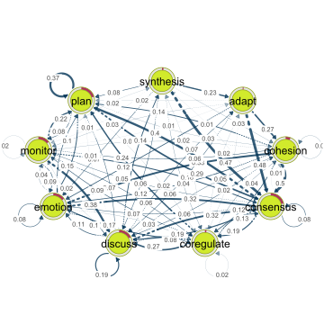
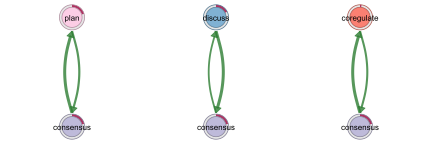

# `tna`: An R package for Transition Network Analysis

`tna` is an R package for the analysis of relational dynamics through
Transition Network Analysis (TNA). TNA provides tools for building TNA
models, plotting transition networks, calculating centrality measures,
and identifying dominant events and patterns. TNA statistical techniques
(e.g., bootstrapping and permutation tests) ensure the reliability of
observed insights and confirm that identified dynamics are meaningful.
See [(Saqr et al., 2025)](https://doi.org/10.1145/3706468.3706513) for
more details on TNA.


## Resources

Check out our tutorials:

- [Basics of
  TNA](https://lamethods.org/book2/chapters/ch15-tna/ch15-tna.html)
- [Frequency-based
  TNA](https://lamethods.org/book2/chapters/ch16-ftna/ch16-ftna.html)
- [Clustering](https://lamethods.org/book2/chapters/ch17-tna-clusters/ch17-tna-clusters.html)

You can also try our [Shiny
app](https://sonsoleslp.shinyapps.io/tna-app/).

## Installation

You can install the most recent stable version of `tna` from
[CRAN](https://cran.r-project.org/package=tna) or the development
version from [GitHub](https://github.com/) by running one of the
following:

``` r
install.packages("tna")

# install.packages("devtools")
# devtools::install_github("sonsoleslp/tna")
```

## Example

Load the package

``` r
library("tna")
```

Example data

``` r
data("group_regulation", package = "tna")
```

Build a Markov model

``` r
tna_model <- tna(group_regulation)
```

``` r
summary(tna_model)
```

| metric                      | value |
|:----------------------------|------:|
| Node Count                  |  9.00 |
| Edge Count                  | 78.00 |
| Network Density             |  1.00 |
| Mean Distance               |  0.05 |
| Mean Out-Strength           |  1.00 |
| SD Out-Strength             |  0.81 |
| Mean In-Strength            |  1.00 |
| SD In-Strength              |  0.00 |
| Mean Out-Degree             |  8.67 |
| SD Out-Degree               |  0.71 |
| Centralization (Out-Degree) |  0.02 |
| Centralization (In-Degree)  |  0.02 |
| Reciprocity                 |  0.99 |

Plot the transition network

``` r
# Default plot
plot(tna_model) 
```


``` r
# Optimized plot
plot(
  tna_model, cut = 0.2, minimum = 0.05, 
  edge.label.position = 0.8, edge.label.cex = 0.7
)
```

 Calculate the centrality
measures

``` r
cent <- centralities(tna_model)
```

|   state    | OutStrength | InStrength | ClosenessIn | ClosenessOut | Closeness | Betweenness | BetweennessRSP | Diffusion | Clustering |
|:----------:|------------:|-----------:|------------:|-------------:|----------:|------------:|---------------:|----------:|-----------:|
|   adapt    |       1.000 |      0.345 |      13.406 |        2.333 |    18.546 |      17.000 |          1.000 |     5.586 |      0.337 |
|  cohesion  |       0.973 |      0.812 |       3.651 |        2.791 |    13.813 |       0.000 |         19.000 |     5.209 |      0.300 |
| consensus  |       0.918 |      2.667 |       0.798 |        4.344 |    11.481 |       0.000 |        103.000 |     4.660 |      0.161 |
| coregulate |       0.977 |      0.567 |       4.547 |        2.309 |     5.974 |       5.000 |         27.000 |     5.148 |      0.306 |
|  discuss   |       0.805 |      1.188 |       1.954 |        2.681 |     7.308 |       0.000 |         53.000 |     4.628 |      0.240 |
|  emotion   |       0.923 |      0.894 |       1.568 |        3.133 |    14.539 |       0.000 |         36.000 |     5.070 |      0.290 |
|  monitor   |       0.982 |      0.346 |       6.243 |        2.210 |     7.757 |       3.000 |         11.000 |     5.157 |      0.289 |
|    plan    |       0.626 |      1.194 |       5.475 |        2.914 |    17.593 |      10.000 |         61.000 |     3.488 |      0.287 |
| synthesis  |       1.000 |      0.192 |      12.271 |        2.184 |    15.901 |      14.000 |          3.000 |     5.583 |      0.359 |

Plot the centrality measures

``` r
plot(cent, ncol = 3)
```


Estimate centrality stability

``` r
estimate_centrality_stability(tna_model)
#> Centrality Stability Coefficients
#> 
#>  InStrength OutStrength Betweenness 
#>         0.9         0.9         0.7
```

Identify and plot communities

``` r
coms <- communities(tna_model)
plot(coms)
```



Find and plot cliques

``` r
cqs <- cliques(tna_model, threshold = 0.12)
plot(cqs)
```



Compare high achievers (first 1000) with low achievers (last 1000)

``` r
tna_model_start_high <- tna(group_regulation[1:1000, ])
tna_model_start_low <- tna(group_regulation[1001:2000, ])
comparison <- permutation_test(
  tna_model_start_high, 
  tna_model_start_low,
  measures = c("InStrength")
)
```

Simple comparison vs. permutation test comparison

``` r
plot_compare(tna_model_start_high, tna_model_start_low)
plot(comparison)
```


Compare centralities

``` r
print(comparison$centralities$stats)
```

|   state    | centrality |   diff_true | effect_size |     p_value |
|:----------:|:----------:|------------:|------------:|------------:|
|   adapt    | InStrength | -0.23693341 |  -6.6808853 | 0.000999001 |
|  cohesion  | InStrength |  0.01634987 |   0.3255056 | 0.749250749 |
| consensus  | InStrength |  0.53680793 |   7.4741341 | 0.000999001 |
| coregulate | InStrength | -0.25275371 |  -7.4623409 | 0.000999001 |
|  discuss   | InStrength | -0.09009651 |  -1.8001285 | 0.076923077 |
|  emotion   | InStrength |  0.19288376 |   4.0066931 | 0.000999001 |
|  monitor   | InStrength | -0.09192991 |  -3.3380625 | 0.001998002 |
|    plan    | InStrength |  0.12225988 |   2.6970534 | 0.009990010 |
| synthesis  | InStrength | -0.04909607 |  -3.2554851 | 0.002997003 |
